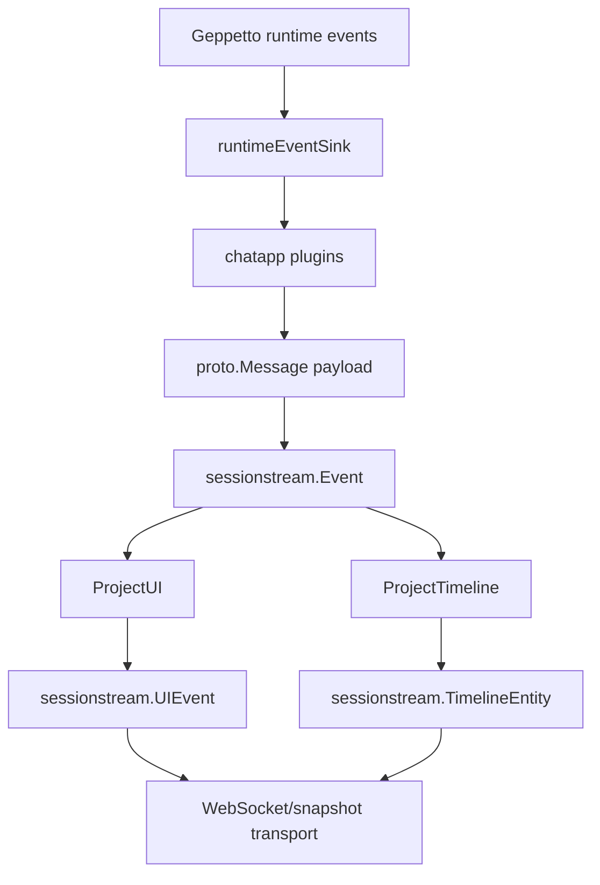

# Protobuf-Backed WebSocket Payload Decoding Analysis and Implementation Guide

## Executive summary

Pinocchio's Go backend already treats the important chat/sessionstream payloads as protobuf messages. Core chat events, reasoning events, backend tool events, frontend tool events, widget events, and Pinocchio-specific agent-mode events are registered in the backend schema registry with concrete `proto.Message` types. Those messages are then transported to the browser through WebSocket and snapshot APIs as JSON/protojson-like payloads, usually inside an `Any`-style envelope.

The frontend does not currently complete that protobuf contract. `@go-go-golems/chat-provider` parses the generic transport envelope into `CanonicalFrame` and `SnapshotEntityFrame`, unwraps payload objects structurally, and then projects fields with helpers such as `asRecord()` and `asString()`. The provider has built-in structural adapters for standard concepts such as messages, widgets, and frontend tools. Pinocchio web-chat has application adapters for agent mode, reasoning, and backend tool history. This works, but the browser is not using generated TypeScript protobuf schemas as the typed payload boundary.

This ticket should standardize payload decoding around protobuf schemas while preserving the current architectural boundary:

- `chat-provider` owns generic sessionstream envelope normalization and provider-scoped decoder registry mechanics.
- Shared/core chat schemas are decoded by provider-owned or shared decoder packs.
- Pinocchio-specific schemas are decoded by Pinocchio-owned decoder packs and timeline adapters.
- Timeline adapters should receive or request typed decoded payloads instead of repeatedly parsing unknown records.
- Unknown payloads must still remain debuggable and renderable through fallback paths.

The goal is not to replace timeline adapters. The goal is to make the input to adapters typed, validated, and generated from the same protobuf schemas that the Go backend registers.

## Problem statement

The current frontend pipeline has two layers:

```text
raw WebSocket/snapshot JSON
  -> chat-provider protocol helpers
  -> CanonicalFrame / SnapshotEntityFrame with payload: unknown
  -> timeline adapters structurally inspect payload fields
  -> provider TimelineEntity / app RenderEntity
```

The backend pipeline is more strongly typed:

```text
Geppetto runtime event
  -> Pinocchio chatapp plugin converts to proto.Message
  -> sessionstream.Event{Name, Payload: proto.Message}
  -> schema registry knows event/entity name -> protobuf message type
  -> WebSocket/snapshot transport emits protojson/Any-like JSON
```

This mismatch creates three problems.

First, the frontend generated protobuf files under `cmd/web-chat/web/src/generated/chatapp` are not currently used by the production provider-backed UI. Their presence suggests a typed protobuf frontend path, but the actual runtime path is structural decoding.

Second, application adapters repeat unsafe field access patterns. For example, the Pinocchio agent-mode adapter currently reads fields from `Record<string, unknown>`:

```ts
const payload = payloadRecord(frame.payload);
const messageId = asString(payload.messageId);
```

This is defensive, but not schema-backed. A field rename, enum encoding change, nested message change, or `Any` wrapping change can compile while breaking runtime behavior.

Third, the provider core cannot express the difference between "payload decoded as a known protobuf message" and "payload is an unknown object preserved for fallback." Both are currently `unknown`/record-shaped values.

## Important clarification: what is and is not protobuf-backed

When this document says "protobuf-backed," it refers to sessionstream chat commands, events, UI events, and durable timeline entities. It does not mean every HTTP request or debug/export route is protobuf.

### Protobuf-backed surfaces

The backend registers schemas for the chat stream. Examples:

- `pkg/chatapp/chat.go:100-124` registers core commands, events, UI events, and the `ChatMessage` timeline entity.
- `pkg/chatapp/plugins/reasoning.go:34-42` registers reasoning events and UI events.
- `pkg/chatapp/plugins/toolcall.go:42-57` registers backend tool events, UI events, and durable tool call/result entities.
- `pkg/chatapp/frontendtools/manager.go:48-53` registers frontend tool events, UI events, and durable frontend tool entities.
- `pkg/chatapp/widgets/plugin.go:39-49` registers widget events, UI events, and durable widget entities.
- `cmd/web-chat/agentmode_chat_feature.go:31-39` registers app-local agent-mode events, UI events, and durable `AgentMode` timeline entity.

The plugin contract enforces protobuf payloads for runtime-published events:

```go
type RuntimeEventContext struct {
    SessionID sessionstream.SessionId
    MessageID string
    Publish   func(ctx context.Context, eventName string, payload proto.Message) error
}
```

The engine publish helper also takes a protobuf message:

```go
func (e *Engine) publish(ctx context.Context, sid sessionstream.SessionId, pub sessionstream.EventPublisher, name string, payload proto.Message) error {
    if payload == nil {
        return fmt.Errorf("event %s payload is nil", name)
    }
    return pub.Publish(ctx, sessionstream.Event{Name: name, SessionId: sid, Payload: payload})
}
```

### Non-protobuf or partially protobuf surfaces

These surfaces should not be forced into the protobuf decoder plan:

- `POST /api/chat/sessions` request body is ordinary JSON. It includes app-level fields such as `profile` and `registry`.
- `POST /api/chat/sessions/{id}/messages` request body is ordinary JSON. It includes `prompt`, `profile`, `registry`, and optional idempotency fields.
- `/api/chat/profile` and `/api/chat/profiles` are ordinary JSON profile APIs.
- Export endpoints return JSON, SQLite, or downloadable archive data depending on the route.
- Debug/reconciliation endpoints are diagnostic JSON/SQLite surfaces.
- WebSocket subscribe frames are JSON control messages sent by the browser.
- Some protobuf messages intentionally contain arbitrary JSON via `google.protobuf.Struct`, for example frontend tool input/result schemas and widget props.
- The browser receives protojson-like objects, not binary protobuf bytes.

The target is therefore precise: standardize **sessionstream payload decoding** around protobuf schemas, not all web-chat HTTP I/O.

## Current backend schema path

The Go backend has a schema registry that maps symbolic command/event/entity names to protobuf message types.



The base chat engine handles standard text/run events in `pkg/chatapp/runtime_sink.go`. It turns Geppetto events such as provider-call lifecycle, text segment start/patch/finish, errors, and interrupts into `chatappv1.*` protobuf messages. Feature plugins then handle additional runtime event families.

For example, the tool-call plugin registers its protobuf schema set and projects typed events into durable typed entities:

```go
reg.RegisterEvent(EventToolCallStarted, &chatappv1.ChatToolCallStarted{})
reg.RegisterUIEvent(EventToolCallStarted, &chatappv1.ChatToolCallStarted{})
reg.RegisterTimelineEntity(TimelineEntityToolCall, &chatappv1.ToolCallEntity{})
```

The agent-mode plugin is app-local because the middleware and UI contract are Pinocchio web-chat-specific:

```go
reg.RegisterEvent(agentModePreviewEventName, &chatappv1.AgentModePreviewUpdate{})
reg.RegisterEvent(agentModeCommittedEventName, &chatappv1.AgentModeCommittedUpdate{})
reg.RegisterUIEvent(agentModePreviewUIName, &chatappv1.AgentModePreviewUpdate{})
reg.RegisterUIEvent(agentModeCommittedUIName, &chatappv1.AgentModeCommittedUpdate{})
reg.RegisterTimelineEntity(agentModeTimelineEntityKind, &chatappv1.AgentModeEntity{})
```

This backend setup means the browser has enough information to decode payloads with generated schemas if it has a matching name/type registry.

## Current frontend decoding path

The provider protocol layer is intentionally generic today. Its types are broad:

```ts
export type CanonicalFrame = Record<string, unknown>;

export type SnapshotEntityFrame = {
  kind?: unknown;
  id?: unknown;
  tombstone?: unknown;
  payload?: unknown;
};
```

`normalizeServerFrame()` recognizes envelope variants such as `hello`, `snapshot`, `subscribed`, `uiEvent`, `error`, `ping`, and `pong`. For UI events, it unwraps the payload structurally:

```ts
if (frame.uiEvent) {
  const uiEvent = asRecord(frame.uiEvent);
  return {
    type: 'ui-event',
    sessionId: asString(uiEvent.sessionId),
    ordinal: uiEvent.eventOrdinal,
    name: asString(uiEvent.name),
    payload: unwrapAnyPayload(uiEvent.payload),
  };
}
```

Snapshot hydration does the same for durable entities:

```ts
export function normalizeSnapshotEntity(entity: SnapshotEntityFrame): SnapshotEntityFrame {
  return {
    ...entity,
    kind: asString(entity?.kind),
    id: asString(entity?.id),
    payload: unwrapAnyPayload(entity?.payload),
  };
}
```

The provider's built-in timeline adapters then access fields structurally. For example, the message adapter reads `payload.messageId`, `payload.role`, `payload.content`, and `payload.status` from a record. The unknown snapshot fallback preserves payloads as generic props so data is not dropped.

This current design was a reasonable migration step. It allowed provider-backed web-chat to work before deciding where generated schemas should live. CHATOVERLAY-012 should now harden this boundary.

## Current generated TypeScript state

The web frontend currently has a Buf template:

```yaml
version: v1
plugins:
  - plugin: buf.build/bufbuild/es
    out: cmd/web-chat/web/src/generated/chatapp
    opt:
      - target=ts
      - import_extension=none
```

Generated files currently present:

```text
cmd/web-chat/web/src/generated/chatapp/proto/pinocchio/chatapp/rpc/v1/rpc_pb.ts
cmd/web-chat/web/src/generated/chatapp/proto/pinocchio/chatapp/v1/chat_pb.ts
```

The generated `chat_pb.ts` exports schemas such as:

- `ChatTextPatchSchema`
- `ChatMessageEntitySchema`
- `ChatReasoningPatchSchema`
- `ChatToolCallStartedSchema`
- `ToolCallEntitySchema`
- `ToolResultEntitySchema`
- `AgentModePreviewUpdateSchema`
- `AgentModeCommittedUpdateSchema`
- `AgentModePreviewClearedSchema`
- `AgentModeEntitySchema`

The generated `rpc_pb.ts` exports envelope schemas such as:

- `RpcLineSchema`
- `SnapshotFrameSchema`
- `SnapshotEntitySchema`
- `UiEventFrameSchema`
- `BackendEventFrameSchema`
- `ErrorFrameSchema`

Important gap: the current generated frontend directory does **not** contain generated `frontendtools/v1` or `widgets/v1` files, even though the backend has proto files and Go bindings for them. A protobuf-standardization project must either generate those TypeScript schemas too or explicitly scope the first phase to `chatapp/v1` and `rpc/v1` only.

## Design goals

1. **Keep provider/app ownership clean.** `chat-provider` should not import Pinocchio-only schemas such as agent-mode unless those schemas become part of a shared schema package.
2. **Decode after envelope normalization.** `CanonicalFrame` and `SnapshotEntityFrame` remain useful generic envelopes; protobuf decoding should enrich their payloads.
3. **Preserve raw data for debugging.** Decoded payloads should keep the raw protojson object and type URL where available.
4. **Support unknown payloads.** Unknown types should remain renderable through fallback behavior.
5. **Make adapters typed without making them brittle.** Adapters should receive typed payload helpers while retaining explicit null/fallback paths.
6. **Support both event-name and entity-kind lookup.** Live UI events are naturally keyed by event `name`; snapshot entities are naturally keyed by entity `kind`; `Any` type URLs can be used as an additional key.
7. **Do not require binary protobuf transport in this phase.** The current transport is JSON/protojson; this project should standardize decoding, not change wire encoding.
8. **Make generated-code ownership explicit.** If generated TypeScript code is used, it must be regenerated by a documented command and covered by tests.

## Proposed architecture

Add a provider-owned payload decoding layer between envelope normalization and timeline projection.

```text
raw transport frame
  -> normalize envelope to CanonicalFrame / SnapshotEntityFrame
  -> decode payload with PayloadDecoderRegistry
  -> DecodedCanonicalFrame / DecodedSnapshotEntityFrame
  -> timeline adapter projection using typed payload helpers
  -> provider/app timeline entity
```

### Decoder registry concept

The registry maps payload identity to a decoder. Payload identity can come from three places:

- UI event name, e.g. `ChatAgentModeCommitted`.
- Snapshot entity kind, e.g. `AgentMode`.
- Protobuf `Any` type URL, e.g. `type.googleapis.com/pinocchio.chatapp.v1.AgentModeEntity`.

A decoder should return both decoded and raw forms.

```ts
import type { GenMessage, MessageShape } from '@bufbuild/protobuf';
import { fromJson } from '@bufbuild/protobuf';

type PayloadDecodeContext =
  | { source: 'ui-event'; name: string; typeUrl?: string }
  | { source: 'snapshot-entity'; kind: string; typeUrl?: string };

type DecodedPayload<T = unknown> = {
  ok: true;
  source: PayloadDecodeContext;
  schemaName: string;
  typeUrl?: string;
  raw: unknown;
  value: T;
} | {
  ok: false;
  source: PayloadDecodeContext;
  typeUrl?: string;
  raw: unknown;
  error?: string;
};

type PayloadDecoder<T = unknown> = {
  name: string;
  schemaName: string;
  eventNames?: string[];
  entityKinds?: string[];
  typeUrls?: string[];
  decode(raw: unknown, context: PayloadDecodeContext): T;
};

function protobufJsonDecoder<Desc extends GenMessage>(args: {
  name: string;
  schema: Desc;
  eventNames?: string[];
  entityKinds?: string[];
  typeUrls?: string[];
}): PayloadDecoder<MessageShape<Desc>> {
  return {
    name: args.name,
    schemaName: args.schema.typeName,
    eventNames: args.eventNames,
    entityKinds: args.entityKinds,
    typeUrls: args.typeUrls,
    decode(raw) {
      return fromJson(args.schema, raw as any, { ignoreUnknownFields: true });
    },
  };
}
```

The exact `@bufbuild/protobuf` generics may need adjustment during implementation. The important design is the contract: generated schemas decode raw protojson payloads into typed message shapes, and the registry controls lookup.

### Preserve Any metadata

The current `unwrapAnyPayload()` returns a payload object but does not preserve enough metadata for typed decoding in all wrapper shapes. The new normalization should preserve both the unwrapped JSON value and the wrapper metadata.

Support these shapes:

```json
{
  "@type": "type.googleapis.com/pinocchio.chatapp.v1.AgentModeEntity",
  "messageId": "chat-msg-1",
  "to": "mock_reviewer"
}
```

```json
{
  "typeUrl": "type.googleapis.com/pinocchio.chatapp.v1.AgentModeEntity",
  "value": {
    "messageId": "chat-msg-1",
    "to": "mock_reviewer"
  }
}
```

```json
{
  "type_url": "type.googleapis.com/pinocchio.chatapp.v1.AgentModeEntity",
  "value": {
    "messageId": "chat-msg-1",
    "to": "mock_reviewer"
  }
}
```

Proposed helper:

```ts
type AnyPayloadEnvelope = {
  typeUrl?: string;
  value: unknown;
  raw: unknown;
};

function unwrapAnyEnvelope(input: unknown): AnyPayloadEnvelope {
  const record = asRecord(input);
  const inlineType = asString(record['@type']);
  const camelType = asString(record.typeUrl);
  const snakeType = asString(record.type_url);
  const typeUrl = inlineType || camelType || snakeType || undefined;

  if ('value' in record && record.value && typeof record.value === 'object') {
    return { typeUrl, value: record.value, raw: input };
  }

  if (inlineType) {
    const { ['@type']: _, ...rest } = record;
    return { typeUrl, value: rest, raw: input };
  }

  return { typeUrl, value: input, raw: input };
}
```

### Decoded frame shape

Do not replace `CanonicalFrame` immediately. Add decoded variants so the migration can be incremental.

```ts
export type DecodedCanonicalFrame<T = unknown> = CanonicalFrame & {
  payloadEnvelope?: AnyPayloadEnvelope;
  decodedPayload?: DecodedPayload<T>;
};

export type DecodedSnapshotEntityFrame<T = unknown> = SnapshotEntityFrame & {
  payloadEnvelope?: AnyPayloadEnvelope;
  decodedPayload?: DecodedPayload<T>;
};
```

Adapters can then choose strict typed behavior:

```ts
const decoded = decodedPayloadAs(frame, AgentModeCommittedUpdateSchema);
if (!decoded) return null;
return agentModeEntity('agent-mode', 'agent_mode', {
  title: decoded.title || 'Agent mode switch',
  data: { from: decoded.from, to: decoded.to, analysis: decoded.analysis },
});
```

or fallback behavior:

```ts
const payload = decodedPayloadAs(frame, AgentModeCommittedUpdateSchema) ?? asRecord(frame.payload);
```

### Registry installation through extensions

Extend chat extensions with decoder registration.

```ts
type ChatExtensionInstallContext = {
  client: ChatClient;
  tools: ToolRegistry;
  widgets: WidgetRegistry;
  timelineAdapters: TimelineAdapterRegistry;
  payloadDecoders: PayloadDecoderRegistry;
};

defineChatExtensions({
  name: 'pinocchio.web-chat.protobuf-decoders',
  payloadDecoders: [
    protobufJsonDecoder({
      name: 'pinocchio.agent-mode.committed',
      schema: AgentModeCommittedUpdateSchema,
      eventNames: ['ChatAgentModeCommitted'],
      typeUrls: ['type.googleapis.com/pinocchio.chatapp.v1.AgentModeCommittedUpdate'],
    }),
    protobufJsonDecoder({
      name: 'pinocchio.agent-mode.entity',
      schema: AgentModeEntitySchema,
      entityKinds: ['AgentMode'],
      typeUrls: ['type.googleapis.com/pinocchio.chatapp.v1.AgentModeEntity'],
    }),
  ],
});
```

`ChatProvider` should create the decoder registry beside the tool/widget/timeline registries, install core decoder packs, then install app extensions, then connect.

## Ownership model

### Provider-owned

`@go-go-golems/chat-provider` should own:

- decoder registry mechanics,
- `Any` envelope preservation helpers,
- decoded frame types,
- typed payload helper utilities,
- core decoders only for schemas that are truly provider-standard,
- structural fallback behavior for unknown payloads,
- tests for generic envelope/decoder behavior.

### Pinocchio-owned

Pinocchio web-chat should own:

- generated TypeScript schema imports for Pinocchio-specific payloads,
- agent-mode decoder pack,
- backend-tool-history decoder pack if those cards remain app-owned,
- Pinocchio adapter changes that use decoded payloads,
- browser smokes proving typed decoding does not change rendered behavior.

### Shared schema package option

Longer term, consider a dedicated generated schema package:

```text
@gogo-golems/chatapp-proto
  -> generated TypeScript schemas for proto/pinocchio/chatapp/**
```

Then both `@go-go-golems/chat-provider` and Pinocchio web-chat could import schemas without reaching into `cmd/web-chat/web/src/generated`. This is cleaner than duplicating generated code inside each app, but it requires package/release work.

For the first implementation, using Pinocchio's existing generated files is acceptable if the scope is Pinocchio web-chat only. For provider-wide generic decoding, a shared package is better.

## Decoder mapping inventory

### Core chatapp v1 mappings

| Event/entity | Backend schema | Frontend generated schema | Proposed owner |
|---|---|---|---|
| `ChatUserMessageAccepted` | `chatappv1.ChatUserMessageAccepted` | `ChatUserMessageAcceptedSchema` | provider core decoder pack |
| `ChatTextSegmentStarted` | `chatappv1.ChatTextSegmentStarted` | `ChatTextSegmentStartedSchema` | provider core decoder pack |
| `ChatTextPatch` | `chatappv1.ChatTextPatch` | `ChatTextPatchSchema` | provider core decoder pack |
| `ChatTextSegmentFinished` | `chatappv1.ChatTextSegmentFinished` | `ChatTextSegmentFinishedSchema` | provider core decoder pack |
| `ChatMessage` snapshot entity | `chatappv1.ChatMessageEntity` | `ChatMessageEntitySchema` | provider core decoder pack |
| `ChatRunStarted/Finished/Stopped/Failed` | `chatappv1.ChatRun*` | `ChatRun*Schema` | provider core decoder pack |
| `ChatReasoning*` | `chatappv1.ChatReasoning*` | `ChatReasoning*Schema` | Pinocchio or provider, depending on whether reasoning is considered generic |
| `ChatTool*` backend history | `chatappv1.ChatTool*` | `ChatTool*Schema`, `ToolCallEntitySchema`, `ToolResultEntitySchema` | Pinocchio web-chat first; provider only if backend tool history becomes generic UI concept |
| `AgentMode*` | `chatappv1.AgentMode*` | `AgentMode*Schema` | Pinocchio web-chat |

### Missing generated mappings

These backend schemas exist but are not currently generated into the web frontend directory:

| Proto package | Backend file | Needed for |
|---|---|---|
| `pinocchio.chatapp.frontendtools.v1` | `proto/pinocchio/chatapp/frontendtools/v1/frontend_tool.proto` | typed decoding of frontend tool requests/results and durable frontend tool entities |
| `pinocchio.chatapp.widgets.v1` | `proto/pinocchio/chatapp/widgets/v1/widget.proto` | typed decoding of widget lifecycle events and durable widget entities |

The implementation must decide whether to update Buf generation to include these files. If the provider's core frontend-tool and widget adapters are going to be protobuf-backed, the answer should be yes.

## Implementation plan

### Phase 1: Capture current wire shapes

Before changing code, create a small evidence script or Playwright helper that records raw WebSocket frames and snapshots for `mock_parity`.

Capture examples for:

- `ChatTextPatch`,
- `ChatReasoningPatch`,
- `ChatToolCallStarted`,
- `ChatToolResultReady`,
- `ChatAgentModeCommitted`,
- snapshot `ChatMessage`,
- snapshot `ChatToolCall`,
- snapshot `ChatToolResult`,
- snapshot `AgentMode`,
- frontend tool/widget events if available.

Store sanitized examples under the ticket `sources/` directory. This protects the implementation from guessing the exact `Any` JSON shape.

Validation:

```bash
node ttmp/.../scripts/capture-mock-parity-frames.js
```

Expected output: JSON fixtures containing raw frame, normalized frame, payload wrapper, and current adapter output.

### Phase 2: Add decoder registry primitives to `chat-provider`

Add files such as:

```text
packages/chat-provider/src/protobuf/payloadDecoderRegistry.ts
packages/chat-provider/src/protobuf/anyEnvelope.ts
packages/chat-provider/src/protobuf/generatedDecoder.ts
```

Core API sketch:

```ts
export type PayloadDecoderRegistry = {
  register(decoder: PayloadDecoder): () => void;
  decodeUIEvent(frame: CanonicalFrame): DecodedPayload;
  decodeSnapshotEntity(entity: SnapshotEntityFrame): DecodedPayload;
  list(): PayloadDecoder[];
};
```

Registry lookup order:

1. `typeUrl` exact match if present.
2. UI event `name` for live frames.
3. Snapshot entity `kind` for hydration frames.
4. No decoder -> `ok: false` with raw payload and no error.

Duplicate registration rules:

- duplicate decoder name is invalid,
- duplicate exact `typeUrl` is invalid unless explicitly marked as override,
- duplicate event/entity name should be invalid by default to avoid ambiguous decoding.

### Phase 3: Preserve payload envelopes in protocol normalization

Change protocol normalization to keep metadata:

```ts
const envelope = unwrapAnyEnvelope(uiEvent.payload);
return {
  type: 'ui-event',
  sessionId: asString(uiEvent.sessionId),
  ordinal: uiEvent.eventOrdinal,
  name: asString(uiEvent.name),
  payload: envelope.value,
  payloadEnvelope: envelope,
};
```

Do the same for snapshot entities.

Compatibility rule: existing adapters should continue to read `frame.payload` and `entity.payload` during the migration. The new `payloadEnvelope` and `decodedPayload` fields are additive.

### Phase 4: Wire decoder registry into `ChatProvider`

`ChatProvider` currently creates store, tool registry, widget registry, timeline adapter registry, tool runtime, client, and WebSocket manager. Add payload decoder registry to that construction sequence.

```tsx
const payloadDecoderRegistry = createPayloadDecoderRegistry();
for (const decoder of corePayloadDecoders) payloadDecoderRegistry.register(decoder);

const client = createChatClient({
  config,
  store,
  toolRegistry,
  toolRuntime,
  adapterRegistry,
  payloadDecoderRegistry,
  wsManager: createWsManager(),
});

installChatExtensions({
  client,
  tools: toolRegistry,
  widgets: widgetRegistry,
  timelineAdapters: adapterRegistry,
  payloadDecoders: payloadDecoderRegistry,
}, normalizeChatExtensions(config));
```

The WebSocket manager should decode frames after normalization and before `applyUIEvent`. Snapshot application should decode entities after `normalizeSnapshotEntity` and before `projectSnapshot`.

### Phase 5: Add core generated decoder pack

This phase needs a packaging decision.

Option A: generate shared schemas into `packages/chat-provider/src/generated/chatapp`.

Option B: create `@go-go-golems/chatapp-proto` and import from that package.

Option C: keep the first implementation Pinocchio-local and skip provider core decoders until packaging is resolved.

Recommended path:

1. For immediate Pinocchio cleanup, implement Pinocchio-local decoders using current `cmd/web-chat/web/src/generated/chatapp`.
2. For reusable provider release, extract generated schemas into a shared package.

Core provider decoders should eventually cover `ChatMessage`, run status, widgets, and frontend tools. If widgets/frontend tools are included, update Buf generation to include `frontendtools/v1` and `widgets/v1`.

### Phase 6: Convert Pinocchio agent-mode adapter to typed decoding

Add a Pinocchio decoder extension:

```text
cmd/web-chat/web/src/features/web-chat/extensions/pinocchio-protobuf-decoders/
  index.ts
  pinocchioPayloadDecoders.ts
```

Register decoders:

```ts
export const pinocchioAgentModePayloadDecoders = defineChatExtensions({
  name: 'pinocchio.web-chat.protobuf-decoders',
  payloadDecoders: [
    protobufJsonDecoder({
      name: 'pinocchio.agent-mode.preview',
      schema: AgentModePreviewUpdateSchema,
      eventNames: ['ChatAgentModePreviewUpdated'],
      typeUrls: ['type.googleapis.com/pinocchio.chatapp.v1.AgentModePreviewUpdate'],
    }),
    protobufJsonDecoder({
      name: 'pinocchio.agent-mode.committed',
      schema: AgentModeCommittedUpdateSchema,
      eventNames: ['ChatAgentModeCommitted'],
      typeUrls: ['type.googleapis.com/pinocchio.chatapp.v1.AgentModeCommittedUpdate'],
    }),
    protobufJsonDecoder({
      name: 'pinocchio.agent-mode.cleared',
      schema: AgentModePreviewClearedSchema,
      eventNames: ['ChatAgentModePreviewCleared'],
      typeUrls: ['type.googleapis.com/pinocchio.chatapp.v1.AgentModePreviewCleared'],
    }),
    protobufJsonDecoder({
      name: 'pinocchio.agent-mode.entity',
      schema: AgentModeEntitySchema,
      entityKinds: ['AgentMode'],
      typeUrls: ['type.googleapis.com/pinocchio.chatapp.v1.AgentModeEntity'],
    }),
  ],
});
```

Then update `pinocchioAgentModeAdapter` to use typed decoded payloads. Keep a fallback path for one release cycle if needed.

### Phase 7: Convert backend tool and reasoning adapters

Once agent mode proves the pattern, convert:

- backend tool live events and snapshot entities,
- reasoning live events,
- durable reasoning hydration through `ChatMessageEntity` if that remains the policy.

This phase will clarify whether backend tool history belongs in provider core or remains Pinocchio app UI. The safer first choice is Pinocchio-owned decoding because `ToolCallCard` is app-owned.

### Phase 8: Convert provider core adapters

Convert provider core adapters after the decoder registry is stable.

Targets:

- `messageTimelineAdapter`,
- `widgetTimelineAdapter`,
- `frontendToolTimelineAdapter`,
- run-status adapter.

This phase may require generated `frontendtools/v1` and `widgets/v1` TypeScript files. If the project chooses the shared schema package, this is where `chat-provider` should start importing it.

### Phase 9: Remove or quarantine structural decoding

Do not remove all structural decoding immediately. Keep it for:

- unknown fallback,
- debug display,
- compatibility with untyped third-party app events,
- tests that intentionally verify unknown payload preservation.

But after typed decoders exist, core adapters should not read `payload.messageId as string` directly. They should use decoded payload helpers.

Acceptance search examples:

```bash
rg "payload\.[a-zA-Z]|as any\).*payload|framePayload\(" packages/chat-provider/src/ws pinocchio/cmd/web-chat/web/src/features/web-chat -S
```

The expected result is not zero, but any remaining structural access should be in fallback/debug helpers or clearly app-specific untyped adapters.

## Testing strategy

### Unit tests for `Any` unwrapping

Test all observed wrapper shapes:

- inline `@type`,
- `typeUrl + value`,
- `type_url + value`,
- raw object without type URL,
- malformed payloads,
- primitive payloads.

### Unit tests for decoder registry lookup

Test lookup by:

- type URL,
- UI event name,
- snapshot entity kind,
- duplicate decoder name,
- duplicate event name,
- decode failure path,
- unknown fallback path.

### Adapter tests

For each converted adapter, test both live and hydration behavior with typed decoded payloads.

Agent-mode tests should cover:

- `ChatAgentModePreviewUpdated` -> `agent_mode_preview`,
- `ChatAgentModeCommitted` -> `agent_mode`,
- `ChatAgentModePreviewCleared` -> delete preview entity,
- snapshot `AgentMode` -> `agent_mode`,
- malformed payload -> no crash and debug-visible decode error.

### Browser smokes

Rerun existing mock parity and hydration smokes. Add one assertion that known payloads were decoded by schema if a debug hook exposes adapter/decoder metadata.

Expected browser behavior should remain unchanged:

- live mock profile renders thinking, backend tool, agent-mode, and assistant message cards,
- reload preserves app cards,
- no raw protobuf `@type` JSON appears for known app entities.

### Go/TypeScript schema consistency tests

Add a lightweight generated-schema consistency test. Options:

1. Compare expected generated schema names against known backend registered names.
2. Add a JSON fixture emitted by Go protojson and decode it in TypeScript.
3. Add a Go test that exports a small sample `Any` payload for each schema and a TS test that decodes it.

The strongest form is a fixture round trip:

```text
Go protojson fixture generation
  -> writes ui-event and snapshot examples
TypeScript decoder test
  -> fromJson(schema, payload)
  -> asserts typed fields
```

## Risks and tradeoffs

| Risk | Why it matters | Mitigation |
|---|---|---|
| Provider imports Pinocchio-only schemas | Breaks the headless/generic boundary. | Use extension-registered app decoders or a shared schema package. |
| Type URL shape differs from assumptions | Decoder registry lookup may miss payloads. | Capture raw fixtures before implementation and support all observed wrapper shapes. |
| Generated frontend code is incomplete | Provider cannot decode widgets/frontend tools if schemas are not generated. | Update Buf generation or scope first phase to generated schemas that exist. |
| Strict decoding breaks forward compatibility | New backend fields could fail old frontends. | Use `ignoreUnknownFields: true` for protojson decoding unless strict mode is intentionally enabled in tests. |
| Decoded payloads increase bundle size | Generated schemas and decoders add browser weight. | Split decoder packs by extension; only install app decoders used by that app. |
| Unknown fallback loses type metadata | Debugging becomes harder. | Preserve `payloadEnvelope.raw` and `typeUrl` even when decoding fails. |
| Structural and typed paths diverge during migration | Adapters may accidentally use different fields. | Convert one adapter at a time and add parity tests for live/hydration output. |

## Open questions

1. Should generated TypeScript schemas live in `cmd/web-chat/web/src/generated`, in `packages/chat-provider`, or in a new shared package such as `@go-go-golems/chatapp-proto`?
2. Should `ChatProvider` core decode standard chat messages itself, or should all schema decoders be installed through extensions?
3. Should reasoning be considered a provider-standard concept or a Pinocchio app concept?
4. Should backend tool history become a provider-standard concept, or should only frontend tool execution remain provider-standard?
5. Should decode errors surface in `onDebugEvent`, timeline fallback entities, console warnings, or all three?
6. Should unknown payloads retain `@type` in visible fallback cards, or hide it behind debug details?
7. Should we eventually switch WebSocket transport to binary protobuf frames, or keep JSON/protojson transport and only standardize decoding?

## Recommended first implementation slice

The first slice should be deliberately narrow:

1. Capture raw mock profile live and hydration payload fixtures.
2. Add `Any` envelope preservation and decoder registry primitives to `chat-provider`.
3. Add Pinocchio-local decoders for `AgentModePreviewUpdate`, `AgentModeCommittedUpdate`, `AgentModePreviewCleared`, and `AgentModeEntity`.
4. Update only `pinocchioAgentModeAdapter` to use typed decoded payloads.
5. Keep structural fallback for agent mode while tests are added.
6. Run TypeScript unit tests and the existing hydration smoke.

This slice proves the design on the exact payload family that originally exposed the live/hydration drift. It does not require solving generated package ownership for every schema at once.

## File references

Provider/frontend protocol files:

- `/home/manuel/workspaces/2026-05-29/chatbot-react/2026-05-29--chatbot-overlay-glm/packages/chat-provider/src/ws/protocol.ts`
- `/home/manuel/workspaces/2026-05-29/chatbot-react/2026-05-29--chatbot-overlay-glm/packages/chat-provider/src/ws/timelineSnapshot.ts`
- `/home/manuel/workspaces/2026-05-29/chatbot-react/2026-05-29--chatbot-overlay-glm/packages/chat-provider/src/ws/timelineEvents.ts`
- `/home/manuel/workspaces/2026-05-29/chatbot-react/2026-05-29--chatbot-overlay-glm/packages/chat-provider/src/ws/timelineAdapterRegistry.ts`
- `/home/manuel/workspaces/2026-05-29/chatbot-react/2026-05-29--chatbot-overlay-glm/packages/chat-provider/src/react/ChatProvider.tsx`
- `/home/manuel/workspaces/2026-05-29/chatbot-react/2026-05-29--chatbot-overlay-glm/packages/chat-provider/src/core/extensions.ts`

Pinocchio frontend files:

- `/home/manuel/workspaces/2026-05-29/chatbot-react/pinocchio/cmd/web-chat/web/src/features/web-chat/extensions/pinocchio-timeline-adapters/pinocchioTimelineAdapters.ts`
- `/home/manuel/workspaces/2026-05-29/chatbot-react/pinocchio/cmd/web-chat/web/src/generated/chatapp/proto/pinocchio/chatapp/v1/chat_pb.ts`
- `/home/manuel/workspaces/2026-05-29/chatbot-react/pinocchio/cmd/web-chat/web/src/generated/chatapp/proto/pinocchio/chatapp/rpc/v1/rpc_pb.ts`
- `/home/manuel/workspaces/2026-05-29/chatbot-react/pinocchio/buf.chatapp.web.gen.yaml`

Pinocchio backend schema files:

- `/home/manuel/workspaces/2026-05-29/chatbot-react/pinocchio/pkg/chatapp/chat.go`
- `/home/manuel/workspaces/2026-05-29/chatbot-react/pinocchio/pkg/chatapp/features.go`
- `/home/manuel/workspaces/2026-05-29/chatbot-react/pinocchio/pkg/chatapp/runtime_sink.go`
- `/home/manuel/workspaces/2026-05-29/chatbot-react/pinocchio/pkg/chatapp/runtime_inference.go`
- `/home/manuel/workspaces/2026-05-29/chatbot-react/pinocchio/pkg/chatapp/projections.go`
- `/home/manuel/workspaces/2026-05-29/chatbot-react/pinocchio/pkg/chatapp/plugins/reasoning.go`
- `/home/manuel/workspaces/2026-05-29/chatbot-react/pinocchio/pkg/chatapp/plugins/toolcall.go`
- `/home/manuel/workspaces/2026-05-29/chatbot-react/pinocchio/pkg/chatapp/frontendtools/manager.go`
- `/home/manuel/workspaces/2026-05-29/chatbot-react/pinocchio/pkg/chatapp/widgets/plugin.go`
- `/home/manuel/workspaces/2026-05-29/chatbot-react/pinocchio/cmd/web-chat/agentmode_chat_feature.go`

Proto source files:

- `/home/manuel/workspaces/2026-05-29/chatbot-react/pinocchio/proto/pinocchio/chatapp/v1/chat.proto`
- `/home/manuel/workspaces/2026-05-29/chatbot-react/pinocchio/proto/pinocchio/chatapp/rpc/v1/rpc.proto`
- `/home/manuel/workspaces/2026-05-29/chatbot-react/pinocchio/proto/pinocchio/chatapp/frontendtools/v1/frontend_tool.proto`
- `/home/manuel/workspaces/2026-05-29/chatbot-react/pinocchio/proto/pinocchio/chatapp/widgets/v1/widget.proto`

## Acceptance checklist

The later implementation can be considered complete when:

- Raw fixture capture documents observed `Any` wrapper shapes.
- `chat-provider` exposes a provider-scoped payload decoder registry.
- Protocol normalization preserves `typeUrl`, raw payload, and unwrapped payload.
- At least one Pinocchio app-specific adapter, preferably agent mode, uses generated protobuf TypeScript schemas for live and hydration payloads.
- Provider core adapters use generated schemas for standard messages, widgets, and frontend tools or explicitly document why a standard concept remains structural.
- Generated TypeScript schema ownership is documented and complete for all decoded payload families.
- Unknown payload fallback still works and preserves debug data.
- Unit tests cover decoder registry lookup and decode failure behavior.
- Adapter tests cover typed live and hydration projection.
- Existing mock parity and hydration browser smokes pass.
- No known app-specific hydrated entity renders as raw protobuf `@type` JSON.
