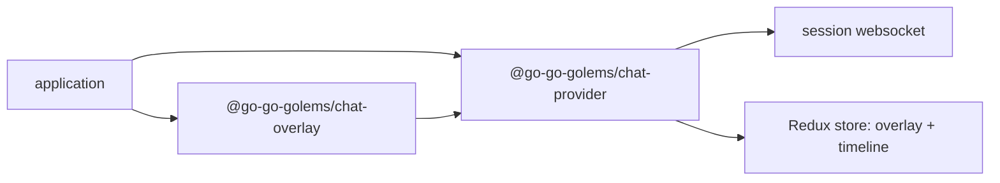
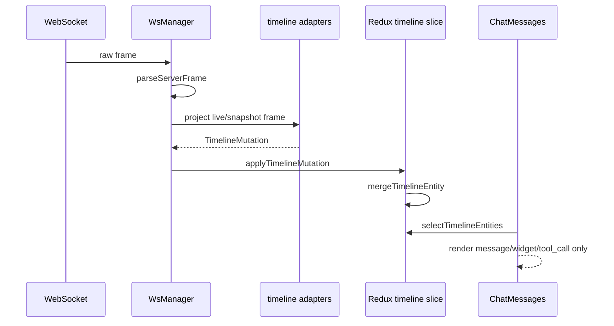
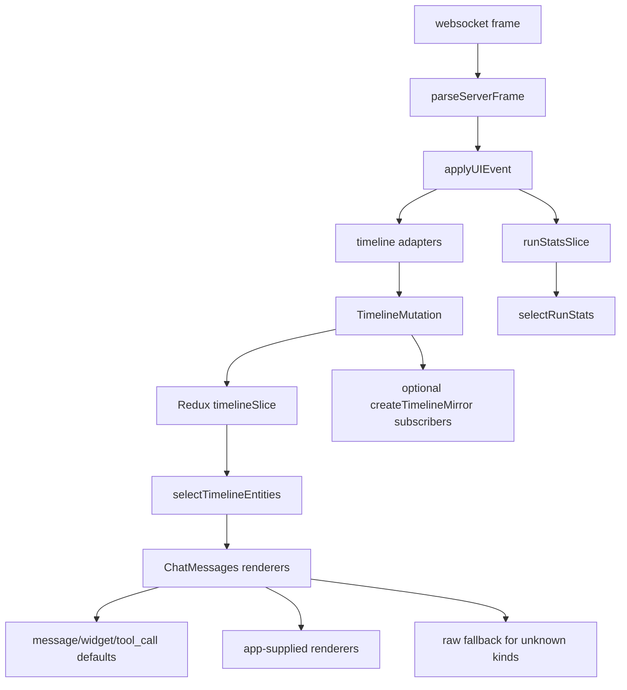

# Timeline mirror, run stats, and renderer extension intern guide

## Executive summary

This ticket covers the first upstreaming tier for `react-chat`: the pieces that are generic chat infrastructure rather than Wesen OS application behavior.

The upstream changes are:

1. **Timeline mirror / external timeline subscription API** in `@go-go-golems/chat-provider`.
2. **Run stats slice and selectors** in `@go-go-golems/chat-provider`.
3. **Extensible `ChatMessages` renderer API** in `@go-go-golems/chat-overlay`, with a guaranteed fallback renderer for unknown timeline kinds.

These are generic enough for the reusable foundation package because they do not know about HyperCards, inventory bundles, launcher windows, or app-specific routing. They are about the common contract of any chat system built on this package: timeline entities arrive over websocket frames, provider state merges patches, consumers need stable selectors, and UI code must render known and unknown timeline entity kinds safely.

The motivating downstream evidence is duplicated code in `wesen-os`: both the launcher and inventory app had to copy timeline mirroring, run-stat derivation, and custom timeline rendering because current `react-chat` does not expose the right upstream primitives.

## Scope and non-scope

### In scope

- Export provider-owned merge/fold semantics for timeline entities.
- Add an external timeline mirror/subscription API for detached windows or host shells that cannot render inside the same `ChatProvider` tree.
- Add run usage stats derived from provider-call metadata events already present in the websocket stream.
- Make `ChatMessages` accept per-kind renderers and a non-dropping default fallback.
- Keep old simple usage working through defaults.
- Add tests and Storybook examples for the new APIs.

### Out of scope for this ticket

- `ChatWindowChrome` and debug/devtools windows. Those are in `REACT-CHAT-CHROME-DEVTOOLS-2026-07`.
- HyperCard block stripping or artifact transforms.
- Profile selectors and `GET /api/chat/profiles`.
- Durable generated app persistence.
- Wesen OS routing/window management.
- Inventory-specific widgets.

## Current architecture

### Packages



- `chat-provider` owns the websocket protocol, provider runtime context, timeline adapters, Redux store, widgets, and tools.
- `chat-overlay` owns reusable React UI such as `ChatPanel`, `ChatMessages`, `ChatComposer`, and sticky-scroll behavior.

### Timeline flow today



Current evidence:

- `WsManager` defines `ChatDebugEvent` and emits raw, parsed, snapshot, and `ui-event` debug events (`packages/chat-provider/src/ws/wsManager.ts:15-22`).
- `WsManager` parses websocket frames and applies snapshots/UI events through `applySnapshot` and `applyUIEvent` (`packages/chat-provider/src/ws/wsManager.ts:96-105`, `:146-183`).
- `timelineSlice` contains the private merge semantics: `applyStreamPatch`, `mergePropsWithPatches`, and `mergeTimelineEntity` (`packages/chat-provider/src/store/timelineSlice.ts:17-104`).
- `selectTimelineEntities` exposes only the provider store's ordered timeline inside `ChatProvider` (`packages/chat-provider/src/store/store.ts:31-35`).
- `ChatMessages` filters entities to `message`, `widget`, and `tool_call` (`packages/chat-overlay/src/overlay/ChatMessages.tsx:9-12`) and then hardcodes render branches (`:25-84`). Unknown kinds disappear.

## Problem 1: detached timeline consumers duplicate provider merge semantics

Downstream detached windows need a timeline view but often cannot sit inside the same `ChatProvider` tree as the chat window. The `wesen-os` workaround is a local `timelineMirror.ts` that ports provider internals line-for-line.

That duplication is dangerous because provider merge semantics are correctness-critical:

- streaming text patches append or replace depending on patch mode,
- widget props patches can append array fields,
- `upsertIfExists` must not create missing entities,
- entity order must remain stable,
- deletion must update both `byId` and `order`.

If `chat-provider` changes `timelineSlice` but downstream mirrors do not change, detached debug windows can show a different conversation than the main chat.

### Proposed API

Add a provider-owned mirror module.

```ts
export type TimelineMirrorState = {
  byId: Record<string, TimelineEntity>
  order: string[]
}

export function createEmptyTimelineMirror(): TimelineMirrorState

export function applyTimelineMutationToMirror(
  mirror: TimelineMirrorState,
  mutation: TimelineMutation,
  options?: { immutable?: boolean }
): TimelineMirrorState

export function createTimelineMirror(args?: {
  initialState?: TimelineMirrorState
  onChange?: (state: TimelineMirrorState, mutation: TimelineMutation) => void
}): TimelineMirrorController

export type TimelineMirrorController = {
  getSnapshot(): TimelineMirrorState
  setSnapshot(state: TimelineMirrorState): void
  apply(mutation: TimelineMutation): void
  clear(): void
  subscribe(listener: () => void): () => void
}
```

Also export selectors that operate on either Redux `RootState` or mirror state:

```ts
export function selectTimelineEntitiesFromState(state: TimelineMirrorState): TimelineEntity[]
export function selectTimelineEntityByIdFromState(state: TimelineMirrorState, id: string): TimelineEntity | undefined
```

### Implementation sketch

Move the private merge helpers out of `timelineSlice.ts` into a pure module:

```ts
// packages/chat-provider/src/store/timelineMerge.ts
export function applyStreamPatch(previous: string, patch: string, mode: unknown): string
export function mergeTimelineEntityIntoState(
  state: TimelineState,
  entity: TimelineEntity,
  createIfMissing: boolean
): void
export function applyTimelineMutationToTimelineState(
  state: TimelineState,
  mutation: TimelineMutation
): void
```

Then update `timelineSlice` and `createTimelineMirror` to use the same functions.

Pseudocode:

```pseudo
function applyTimelineMutationToTimelineState(state, mutation):
    if mutation.deleteId:
        delete state.byId[mutation.deleteId]
        state.order = state.order without mutation.deleteId

    if mutation.upsert:
        mergeTimelineEntityIntoState(state, mutation.upsert, createIfMissing=true)

    if mutation.upsertIfExists:
        mergeTimelineEntityIntoState(state, mutation.upsertIfExists, createIfMissing=false)
```

### Why this belongs upstream

The timeline merge rules are part of the provider's protocol semantics. Any external mirror that wants to display the same conversation must use the same implementation. Exporting the mirror prevents silent drift.

## Problem 2: run stats are scraped from debug events instead of provider state

Provider-call metadata already appears in UI events, but current `chat-provider` only derives coarse `runStatus`. Downstream `wesen-os` scrapes `ChatProviderCallMetadataUpdated` and `ChatProviderCallFinished` from `parsed-frame` debug events to compute token counts and throughput. Debug events should be for inspection, not stable product logic.

### Current event path

- `ChatProviderConfig` accepts `onDebugEvent` (`packages/chat-provider/src/core/createChatClient.ts:16-19`).
- `createChatClient` forwards it to `WsManager.connect` (`packages/chat-provider/src/core/createChatClient.ts:120-123`).
- `WsManager` emits `parsed-frame` before normal projection (`packages/chat-provider/src/ws/wsManager.ts:101-105`).
- `runStatusTimelineAdapter` handles run started/finished/stopped/failed but does not track usage (`packages/chat-provider/src/ws/timelineEvents.ts:42-62`).

### Proposed stats state

Add `runStatsSlice` to `chat-provider`.

```ts
export interface ChatUsageTotals {
  inputTokens: number
  outputTokens: number
  cachedTokens: number
  cacheCreationInputTokens: number
  cacheReadInputTokens: number
}

export interface ChatRunStats {
  isStreaming: boolean
  streamStartTime: number | null
  streamOutputTokens: number
  lastRun: ChatUsageTotals | null
  lastRunDurationMs: number | null
  lastRunStopReason: string | null
  totals: ChatUsageTotals
  completedRuns: number
}
```

Selectors:

```ts
selectRunStats(state): ChatRunStats
selectRunStatsSummary(state): string
selectHasRunUsage(state): boolean
```

Actions/reducers:

```ts
runStarted(nowMs)
textPatchObserved({ chars })
providerCallMetadataUpdated({ usage })
providerCallFinished({ usage, durationMs, stopReason })
runFinished({ status })
resetRunStats()
```

### Event projection design

Do not route stats through the timeline entity list. Usage metadata is not a chat message, widget, or tool call; it is session/run state. Add a stats event handler near `applyUIEvent`, or teach the existing adapter path to emit side effects beyond `TimelineMutation`.

Minimal implementation option:

```ts
export function applyRunStatsEvent(frame: CanonicalFrame, dispatch: AppDispatch, now = Date.now()) {
  if (frame.type !== 'ui-event') return
  switch (frame.name) {
    case 'ChatRunStarted': dispatch(runStatsSlice.actions.runStarted(now)); break
    case 'ChatTextPatch': dispatch(runStatsSlice.actions.textPatchObserved({ chars: text.length })); break
    case 'ChatProviderCallMetadataUpdated': dispatch(runStatsSlice.actions.providerCallMetadataUpdated({ usage })); break
    case 'ChatProviderCallFinished': dispatch(runStatsSlice.actions.providerCallFinished({ usage, durationMs, stopReason })); break
    case 'ChatRunFinished':
    case 'ChatRunStopped':
    case 'ChatRunFailed': dispatch(runStatsSlice.actions.runFinished({ status: frame.name })); break
  }
}
```

Call it from `applyUIEvent` before or after timeline projection. Use one code path for live events; for hydration, either leave stats empty or derive a best-effort summary only if snapshot entities include provider-call metadata.

### Why this belongs upstream

Token usage, call duration, stop reason, streaming throughput, and completed-run totals are provider-level concepts. They are useful to any chat client, not only Wesen OS.

## Problem 3: `ChatMessages` cannot render custom timeline kinds safely

`ChatMessages` currently accepts only `{ bottomRef }` and filters to three kinds. This is insufficient for applications that extend timeline adapters with custom entity kinds or want alternate rendering for known kinds.

The correctness bug is not only lack of customization. It is silent dropping. A reusable chat renderer should never make timeline entities disappear without a fallback.

### Proposed renderer API

```tsx
export type ChatMessageRenderMode = 'normal' | 'compact' | 'debug'

export type TimelineEntityRendererContext = {
  entity: TimelineEntity
  index: number
  renderMode: ChatMessageRenderMode
}

export type TimelineEntityRenderer = (ctx: TimelineEntityRendererContext) => React.ReactNode

export interface ChatMessagesProps {
  bottomRef?: RefObject<HTMLDivElement | null>
  renderMode?: ChatMessageRenderMode
  renderers?: Record<string, TimelineEntityRenderer>
  fallbackRenderer?: TimelineEntityRenderer
  visibleKinds?: string[] | ((entity: TimelineEntity) => boolean)
  empty?: React.ReactNode
}
```

Default behavior:

- `message` -> built-in message renderer.
- `widget` -> `WidgetOutlet`.
- `tool_call` -> `ToolCallOutlet`.
- unknown kinds -> collapsed raw entity fallback.
- `visibleKinds` defaults to all entities with default/fallback renderers available, not just the three old kinds.

### Default fallback renderer

```tsx
export function RawTimelineEntityFallback({ entity }: { entity: TimelineEntity }) {
  return (
    <details className="chat-overlay-raw-entity">
      <summary>{entity.kind} · {entity.id}</summary>
      <pre>{JSON.stringify(entity.props, null, 2)}</pre>
    </details>
  )
}
```

### Migration example

Old app-side custom timeline renderer:

```tsx
<ChatTimeline bottomRef={tailRef} renderMode="debug" />
```

New upstream extension:

```tsx
<ChatMessages
  bottomRef={tailRef}
  renderMode={debugOpen ? 'debug' : 'normal'}
  renderers={{
    inventory_code_card: ({ entity, renderMode }) => <InventoryCodeCard entity={entity} debug={renderMode === 'debug'} />,
  }}
/>
```

## Combined architecture after implementation



## File-level implementation plan

### Phase 1: Extract pure timeline merge helpers

Files:

- `packages/chat-provider/src/store/timelineSlice.ts`
- new `packages/chat-provider/src/store/timelineMerge.ts`
- new `packages/chat-provider/src/store/timelineMirror.ts`
- `packages/chat-provider/src/index.ts`

Steps:

1. Export `TimelineState` type or define a reusable equivalent.
2. Move `applyStreamPatch`, `mergePropsWithPatches`, and `mergeTimelineEntity` into `timelineMerge.ts`.
3. Add `applyTimelineMutationToTimelineState`.
4. Update `timelineSlice` reducers to call the pure helpers.
5. Add `createTimelineMirror` built on the same helper.
6. Export mirror APIs from `chat-provider`.

Tests:

- append vs replace patch modes,
- widget props patch with array append,
- `upsertIfExists` no-op when missing,
- delete removes from both maps,
- mirror and Redux reducer produce identical state for a mutation sequence.

### Phase 2: Add run stats slice

Files:

- new `packages/chat-provider/src/store/runStatsSlice.ts`
- `packages/chat-provider/src/store/store.ts`
- `packages/chat-provider/src/ws/timelineEvents.ts` or new `packages/chat-provider/src/ws/runStatsEvents.ts`
- `packages/chat-provider/src/index.ts`

Steps:

1. Add `runStats` reducer to `createChatStore`.
2. Implement usage parsing helpers.
3. Add `selectRunStats` and summary selectors.
4. Call `applyRunStatsEvent` from `applyUIEvent`.
5. Reset stats on `client.reset()`.
6. Export types/selectors.

Tests:

- `ChatRunStarted` marks streaming and resets scratch.
- `ChatTextPatch` estimates tokens when no usage metadata exists.
- `ChatProviderCallMetadataUpdated` overrides live estimate.
- Multiple `ChatProviderCallFinished` events accumulate a run.
- `ChatRunFinished` commits run totals to conversation totals.

### Phase 3: Make `ChatMessages` extensible

Files:

- `packages/chat-overlay/src/overlay/ChatMessages.tsx`
- maybe new `packages/chat-overlay/src/overlay/renderers/*`
- `packages/chat-overlay/src/index.ts`
- Storybook files under `packages/chat-overlay/src/stories/`

Steps:

1. Add `ChatMessagesProps` with `renderers`, `fallbackRenderer`, `renderMode`, `visibleKinds`, and `empty`.
2. Extract built-in renderers for `message`, `widget`, and `tool_call`.
3. Add `RawTimelineEntityFallback`.
4. Preserve current default UI when no props are passed.
5. Add Storybook examples for default, custom kind, debug mode, and unknown fallback.

Tests:

- existing default render snapshots still pass,
- custom renderer is called for a custom kind,
- unknown entity renders fallback instead of disappearing,
- `visibleKinds` can filter intentionally,
- `bottomRef` still renders at tail.

## Downstream migration plan

After publishing a new `chat-provider`/`chat-overlay` version:

1. Update `wesen-os` and inventory dependencies.
2. Delete local `timelineMirror.ts` copies.
3. Replace local run stats store with `selectRunStats` and a small UI footer.
4. Replace local `ChatTimeline` with `ChatMessages` plus renderers.
5. Keep HyperCard block transforms app-side until a later artifact-transform ticket.

## Risks and mitigations

- **Risk:** Exporting too many internals freezes implementation details.  
  **Mitigation:** Export stable operations (`applyTimelineMutationToMirror`), not every helper unless tests establish the public contract.

- **Risk:** Stats events may vary by backend.  
  **Mitigation:** Treat provider-call metadata as optional. Selectors should return empty stats when events never arrive.

- **Risk:** Fallback rendering could expose large sensitive payloads.  
  **Mitigation:** Default fallback should be collapsed, truncate long JSON, and allow apps to replace it.

- **Risk:** `ChatMessages` API becomes too broad.  
  **Mitigation:** Keep the extension point simple: per-kind renderer, fallback renderer, render mode, visible filter.

## Acceptance criteria

- A downstream detached debug window can reconstruct a timeline using exported `chat-provider` mirror APIs without copying merge code.
- A downstream stats footer can use `selectRunStats` without subscribing to `onDebugEvent`.
- `ChatMessages` can render a custom timeline kind through props.
- Unknown timeline kinds are visible via fallback.
- Existing basic `ChatPanel` usage remains source-compatible.
- Unit tests cover merge parity, stats event projection, and renderer fallback.

## References

- `/home/manuel/code/wesen/go-go-golems/react-chat/packages/chat-provider/src/store/timelineSlice.ts`
- `/home/manuel/code/wesen/go-go-golems/react-chat/packages/chat-provider/src/store/store.ts`
- `/home/manuel/code/wesen/go-go-golems/react-chat/packages/chat-provider/src/ws/timelineEvents.ts`
- `/home/manuel/code/wesen/go-go-golems/react-chat/packages/chat-provider/src/ws/wsManager.ts`
- `/home/manuel/code/wesen/go-go-golems/react-chat/packages/chat-overlay/src/overlay/ChatMessages.tsx`
- `/home/manuel/code/wesen/go-go-golems/react-chat/packages/chat-overlay/src/overlay/ChatPanel.tsx`
- `/home/manuel/workspaces/2026-03-02/os-openai-app-server/wesen-os/apps/os-launcher/src/chat/timelineMirror.ts`
- `/home/manuel/workspaces/2026-03-02/os-openai-app-server/wesen-os/apps/os-launcher/src/chat/chatStatsStore.ts`
- `/home/manuel/workspaces/2026-03-02/os-openai-app-server/wesen-os/apps/os-launcher/src/chat/StatsFooter.tsx`
