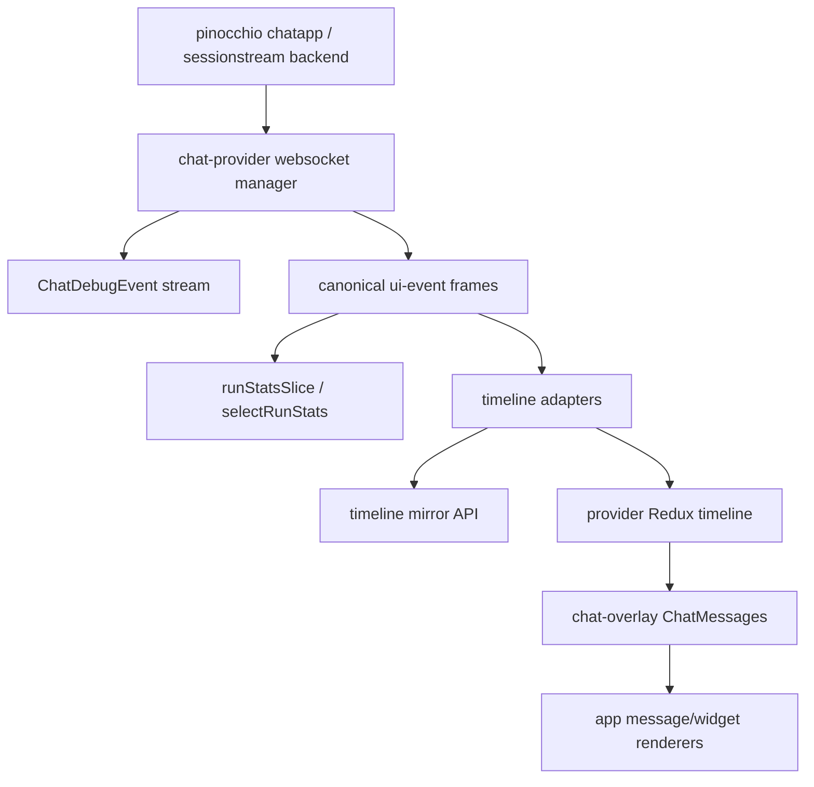
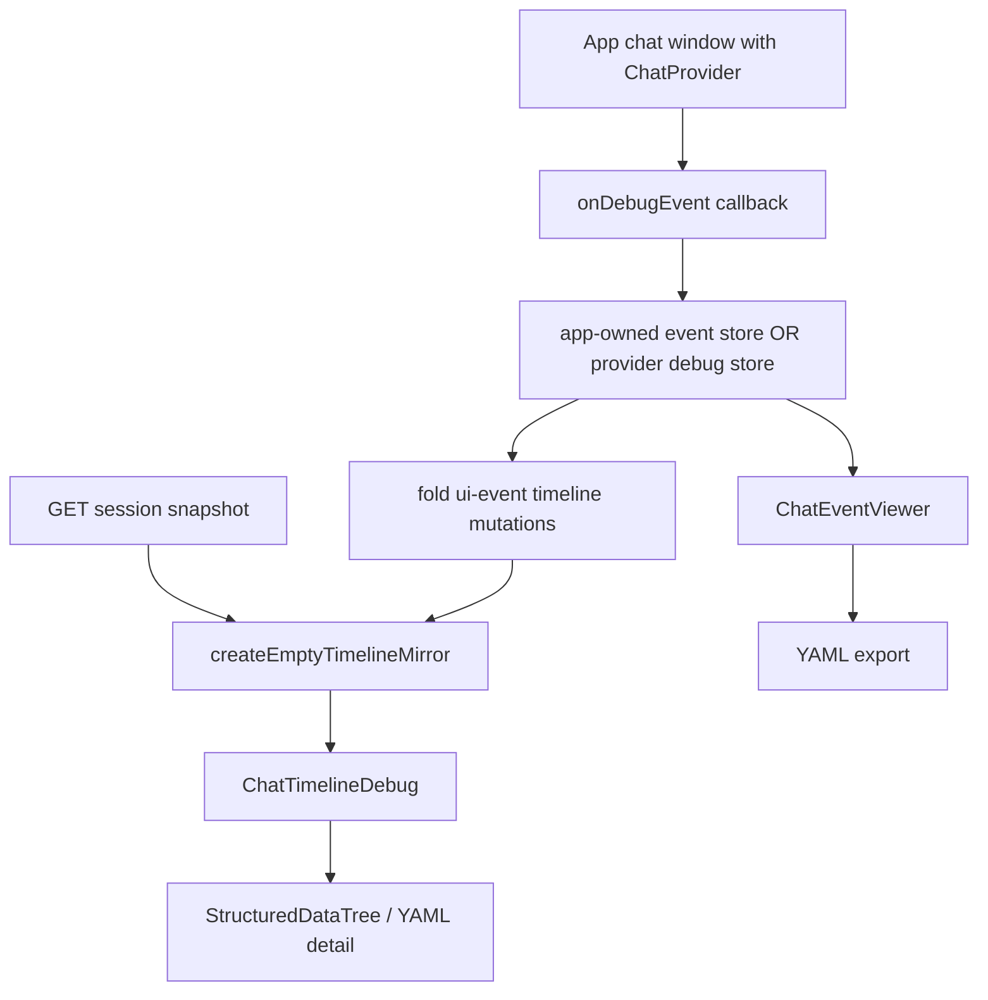

# React Chat Devtools and os-chat Retirement Intern Guide

## Executive summary

`@go-go-golems/os-chat` is no longer the right home for reusable chat UI. It was built around the old SEM/webchat runtime: `ChatConversationWindow`, a custom `wsManager`, profile/runtime endpoints, SEM timeline mappers, and Redux slices that predate the current `pinocchio` `chatapp` plus `sessionstream` contract. The reusable runtime is now `react-chat`, split into `@go-go-golems/chat-provider` and `@go-go-golems/chat-overlay`.

The remaining problem is that the best debug experience still lives outside `react-chat`. The launcher and inventory apps both have local Event Viewer and Timeline Debug windows derived from the old `os-chat` devtools. The launcher copied the helper utilities locally; inventory still imports helper utilities from `@go-go-golems/os-chat`. Both apps now use `chat-provider` events and the upstream timeline mirror, so the implementation has already crossed the conceptual boundary. The devtools should move upstream into `react-chat`, then downstream apps should delete their local copies and remove `os-chat` entirely.

This ticket covers three outcomes:

1. Add reusable devtools and supporting helpers to `react-chat`.
2. Migrate `wesen-os` launcher and `go-go-app-inventory` to those exports.
3. Retire `@go-go-golems/os-chat` from the downstream apps, then deprecate or remove the legacy package from `go-go-os-frontend`.

The work should be staged. First upstream generic pieces into `react-chat`; then migrate launcher and inventory; then remove legacy reducers/theme/debug helper imports; only then delete or deprecate `os-chat`. Do not move the new system back into `os-chat`: that would keep the old package name and old protocol assumptions alive after the architecture has moved on.

## Problem statement and scope

### What problem are we solving?

The runtime migration has reached an awkward middle state:

- `react-chat` owns the active chat runtime and message timeline APIs.
- `wesen-os` and inventory already render chat through `chat-provider` / `chat-overlay`.
- `os-chat` remains installed because it still supplies old reducers, theme CSS, and some debug display utilities.
- Event Viewer and Timeline Debug are duplicated in downstream apps instead of being reusable upstream components.

This causes four practical problems.

1. **Duplicate devtools code.** The launcher and inventory Event Viewer / Timeline Debug implementations are local ports of the same old `os-chat` ideas.
2. **Wrong dependency direction.** Inventory imports debug helpers from `@go-go-golems/os-chat`, even though the debug windows consume `chat-provider` events.
3. **Legacy package retention.** `os-chat` cannot be removed while apps still import reducers/theme/helpers from it.
4. **API drift risk.** The devtools should track `chat-provider` debug event shapes and timeline mirror semantics. Keeping them downstream makes drift likely.

### In scope

This ticket includes:

- reusable debug event entry types and classifiers for `ChatDebugEvent`;
- a reusable debug event store or store adapter API;
- reusable `ChatEventViewer` UI;
- reusable `ChatTimelineDebug` UI;
- shared utilities: YAML formatting, clipboard copy, structured data tree, syntax highlighting, export helpers, timeline debug model;
- Storybook/test coverage for the reusable devtools;
- migration of launcher and inventory debug windows to `react-chat` exports;
- removal of `@go-go-golems/os-chat` imports from launcher and inventory;
- removal or deprecation of the `os-chat` package after no consumers remain.

### Out of scope

This ticket does not include:

- changing the `pinocchio` or `sessionstream` wire protocol;
- changing inventory artifact extraction or HyperCard card policy;
- changing the already-published `chat-provider` timeline mirror/run stats/renderers APIs except where devtools need additional exported helpers;
- rewriting unrelated desktop packages that happen to import `os-chat` in old docs or tests outside the active apps;
- archiving the separate Go repository `go-go-os-chat` without a separate audit. This ticket can record that it appears superseded, but archiving that repo should be a deliberate repository-owner action after checking all Go consumers.

## Current-state architecture

### Active chat runtime: react-chat

`react-chat` now owns the active reusable chat runtime. The previous upstreaming ticket added provider-owned timeline mechanics, run stats, and renderer extension points. The current active downstream apps use those APIs.



The new devtools should attach to the same debug event and mirror APIs. They should not reintroduce the old SEM registry or old `os-chat` transport.

### Launcher debug window state

The launcher implementation is already a local `react-chat` devtools prototype. Evidence from `apps/os-launcher/src/chat/ChatDebugWindows.tsx`:

- lines 1-7 describe a detached Event Viewer and Timeline Debug rebuilt on `chat-provider` debug events;
- lines 16-18 say detached windows reconstruct timeline state with upstream timeline mirror helpers;
- lines 20-39 import `createEmptyTimelineMirror`, `applyTimelineMutationToMirror`, local debug store/helpers, YAML, syntax highlighting, structured tree, and timeline debug model;
- lines 150-184 show `ChatEventViewerWindow` subscribing to a local `chatDebugStore` and dropping events while paused;
- lines 188-200 memoize visible rows and key auto-scroll to visible count;
- lines 114-135 implement YAML export for visible events.

This is a good source implementation because it has already been updated for `chat-provider` semantics and includes two performance fixes over the old `os-chat` version: lazy YAML serialization and lazy sanitize.

### Inventory debug window state

Inventory has a similar local debug window, but it still imports helper utilities from `@go-go-golems/os-chat`. Evidence from `workspace-links/go-go-app-inventory/apps/inventory/src/launcher/chat/InventoryDebugWindows.tsx`:

- lines 1-7 describe the local debug windows as a rebuild of the original `os-chat` look on `chat-provider` debug stream;
- lines 9-10 explicitly state that pure display helpers are reused from `@go-go-golems/os-chat`;
- lines 19-31 import timeline mirror helpers from `chat-provider` and display helpers from `os-chat`;
- lines 43-65 define the same family filter constants as the launcher version.

Inventory therefore gives the migration acceptance criterion: after this ticket, line 21-31 should import from `@go-go-golems/chat-overlay/devtools` or another `react-chat` export, not from `@go-go-golems/os-chat`.

### os-chat public surface

`workspace-links/go-go-os-frontend/packages/os-chat/src/chat/index.ts` exports the old package surface. Evidence:

- lines 1-8 export `ChatConversationWindow`, profile selector, sidebar, views, and old `StatsFooter`;
- lines 9-15 export old debug windows and display helpers;
- lines 16-19 export SEM helpers and timeline mappers;
- lines 23-33 export old runtime/profile APIs;
- lines 34-41 export old chat Redux slices, selectors, and websocket manager.

This file shows why `os-chat` is not a good home for the new devtools. It is a mixed legacy package whose public API points at the old runtime. Keeping the new devtools there would force consumers to keep importing a package that also exports the old protocol.

### Remaining downstream os-chat blockers

`os-chat` is still imported by active apps.

Launcher blockers:

- `apps/os-launcher/src/app/store.ts` line 3 imports `chatProfilesReducer`, `chatSessionReducer`, `chatWindowReducer`, and `timelineReducer` from `@go-go-golems/os-chat`.
- `apps/os-launcher/src/main.tsx` line 7 imports `@go-go-golems/os-chat/theme`.

Inventory blockers:

- `apps/inventory/src/app/store.ts` lines 1-6 import the same old chat reducers.
- `apps/inventory/src/main.tsx` line 9 imports `@go-go-golems/os-chat/theme`.
- `InventoryDebugWindows.tsx` imports debug display helpers from `os-chat` as described above.

These imports must disappear before `@go-go-golems/os-chat` can be removed from package manifests.

## Gap analysis

### What react-chat already has

`react-chat` already has the generic runtime pieces that the devtools need:

- `ChatDebugEvent` emitted by `chat-provider` as websocket lifecycle, raw frame, parsed frame, snapshot, and UI-event records;
- timeline adapters and canonical timeline mutations;
- `createEmptyTimelineMirror` and `applyTimelineMutationToMirror` for detached consumers;
- `selectTimelineEntities` for in-provider consumers;
- `ChatMessages` renderer maps and unknown-kind fallback.

### What react-chat lacks

It does not yet have:

- a public debug event classification API;
- a reusable bounded event buffer;
- a generic Event Viewer component;
- a generic Timeline Debug component;
- shared YAML/structured-tree/syntax-highlight helpers;
- a slot-based chrome primitive that downstream apps can wrap around chat windows;
- Storybook stories for devtools states;
- migration documentation for removing `os-chat` consumers.

### What os-chat still provides temporarily

`os-chat` still provides useful implementation references:

- old Event Viewer and Timeline Debug layout;
- structured data tree;
- syntax highlighter;
- YAML formatter;
- tests for debug helpers.

Those should be copied/adapted into `react-chat`, not imported long-term.

## Proposed architecture

### Package layout

Add a devtools sub-area to `@go-go-golems/chat-overlay` and debug helper types to `@go-go-golems/chat-provider` if needed.

Recommended file layout:

```text
packages/chat-provider/src/debug/
  classifyDebugEvent.ts
  debugEventStore.ts
  index.ts

packages/chat-overlay/src/devtools/
  ChatEventViewer.tsx
  ChatTimelineDebug.tsx
  StructuredDataTree.tsx
  SyntaxHighlight.tsx
  clipboard.ts
  timelineDebugModel.ts
  yamlFormat.ts
  styles.css
  index.ts

packages/chat-overlay/src/overlay/
  ChatWindowChrome.tsx
```

Recommended exports:

```json
{
  "exports": {
    ".": "./src/index.ts",
    "./devtools": "./src/devtools/index.ts",
    "./theme/retro-mac.css": "./src/theme/retro-mac.css"
  }
}
```

The main export can re-export stable devtool components if the package wants a broad top-level surface, but a subpath export keeps the default overlay import lighter and makes the devtools boundary explicit.

### Data flow



The devtools should not assume that they are rendered inside the same `ChatProvider` tree as the chat window. The current downstream windows are detached desktop windows. They need an explicit event source and, for timeline debug, a snapshot seed plus mutation stream.

### API sketch: debug event classification

`chat-provider` should expose classification utilities close to the `ChatDebugEvent` type:

```ts
export type ChatDebugFamily = 'llm' | 'tool' | 'widget' | 'timeline' | 'ws' | 'raw' | 'other';

export interface ChatDebugEntry {
  id: string;
  seq: number;
  at: number;
  family: ChatDebugFamily;
  eventType: string;
  eventId: string;
  summary: string;
  event: ChatDebugEvent;
}

export interface ChatDebugClassifier {
  classify(event: ChatDebugEvent): Pick<ChatDebugEntry, 'family' | 'eventType' | 'eventId'>;
  summarize(event: ChatDebugEvent): string;
}

export function createDefaultChatDebugClassifier(options?: {
  familyAliases?: Partial<Record<string, ChatDebugFamily>>;
}): ChatDebugClassifier;
```

Why this belongs in `chat-provider`: the classifier understands `ChatDebugEvent` and canonical frame names. It should evolve with provider debug event shapes.

### API sketch: debug event store

Provide a small external store, but keep apps free to provide their own source.

```ts
export interface ChatDebugEventStore {
  push(conversationId: string, event: ChatDebugEvent): void;
  clear(conversationId: string): void;
  getSnapshot(conversationId: string): ChatDebugEntry[];
  subscribe(conversationId: string, listener: () => void): () => void;
}

export function createChatDebugEventStore(options?: {
  maxEntriesPerConversation?: number;
  classifier?: ChatDebugClassifier;
  now?: () => number;
}): ChatDebugEventStore;

export function useChatDebugEntries(store: ChatDebugEventStore, conversationId: string): ChatDebugEntry[];
```

This mirrors the current downstream stores, but makes the behavior reusable and testable. Apps can keep a singleton store per desktop runtime or construct scoped stores for stories/tests.

### API sketch: Event Viewer

`ChatEventViewer` should be a pure component over entries plus optional actions. A convenience wrapper can bind it to a store.

```ts
export interface ChatEventViewerProps {
  conversationId: string;
  entries: ChatDebugEntry[];
  onClear?: () => void;
  maxVisibleEntries?: number;
  defaultHiddenFamilies?: ChatDebugFamily[];
  defaultHideTextPatch?: boolean;
  familyLabels?: Partial<Record<ChatDebugFamily, string>>;
  familyColors?: Partial<Record<ChatDebugFamily, string>>;
  exportFilePrefix?: string;
}

export function ChatEventViewer(props: ChatEventViewerProps): JSX.Element;

export interface ChatEventViewerFromStoreProps extends Omit<ChatEventViewerProps, 'entries' | 'onClear'> {
  store: ChatDebugEventStore;
}

export function ChatEventViewerFromStore(props: ChatEventViewerFromStoreProps): JSX.Element;
```

The component should preserve the current behavior:

- family filter pills;
- pause/resume;
- hold/follow stream;
- hide noisy text patch events;
- copy payload;
- export visible YAML;
- lazy YAML serialization only for expanded rows;
- memoized rows so adding an event does not re-render every row.

### API sketch: Timeline Debug

Timeline Debug should accept a ready snapshot or a mirror-like state. It should not fetch app-specific REST endpoints itself. Downstream windows can fetch snapshots from their host and fold mutations with `applyTimelineMutationToMirror`.

```ts
export interface ChatTimelineDebugProps {
  conversationId: string;
  timeline: TimelineMirrorState;
  title?: string;
  selectedEntityId?: string | null;
  onSelectedEntityIdChange?: (id: string | null) => void;
  sanitize?: (value: unknown) => unknown;
}

export function ChatTimelineDebug(props: ChatTimelineDebugProps): JSX.Element;

export function buildTimelineDebugSnapshot(
  conversationId: string,
  timeline: TimelineMirrorState,
  options?: { sanitize?: (value: unknown) => unknown },
): TimelineDebugSnapshot;
```

The component should preserve:

- entity list by order;
- kind counts;
- selected entity detail pane;
- tree/YAML toggle;
- copy conversation YAML;
- export conversation YAML;
- copy selected entity YAML;
- lazy sanitization for selected/exported values.

### API sketch: ChatWindowChrome

The chrome part belongs in `chat-overlay`, but it must stay policy-free. It should not fetch profiles, open desktop windows, or know about inventory/assistant route conventions.

```ts
export interface ChatWindowChromeProps {
  title: React.ReactNode;
  connectionStatus?: React.ReactNode;
  profileSlot?: React.ReactNode;
  toolbarSlot?: React.ReactNode;
  debugSlot?: React.ReactNode;
  footerSlot?: React.ReactNode;
  children: React.ReactNode;
}

export function ChatWindowChrome(props: ChatWindowChromeProps): JSX.Element;
```

Downstream apps keep profile fetching, starter suggestions, desktop window routing, and domain footer text.

## Decision records

### Decision: React-chat supersedes os-chat for reusable chat runtime/UI

- **Context:** `os-chat` exports the old SEM/webchat runtime, while active apps have moved to `chat-provider` and `chat-overlay`.
- **Options considered:** (a) move new devtools back into `os-chat`; (b) keep local downstream copies; (c) upstream devtools into `react-chat` and retire `os-chat`.
- **Decision:** Choose (c).
- **Rationale:** The devtools consume `ChatDebugEvent` and timeline mirror APIs from `chat-provider`. Their natural dependency is `react-chat`. Keeping them in `os-chat` would preserve a package that also exports old runtime and SEM APIs.
- **Consequences:** Downstream apps will migrate imports to `react-chat`; `os-chat` can be deprecated or removed after no active imports remain.
- **Status:** accepted.

### Decision: Keep devtools source-agnostic

- **Context:** Launcher and inventory open detached windows outside the original `ChatProvider` tree.
- **Options considered:** (a) make devtools read provider context directly; (b) require apps to pass entries/timeline; (c) support both pure props and store-bound convenience wrappers.
- **Decision:** Provide pure components plus store-bound wrappers.
- **Rationale:** Pure props make components testable and usable in detached desktop windows. Store-bound wrappers reduce boilerplate for normal use.
- **Consequences:** Apps must still wire snapshot fetching and event forwarding where window routing is app-specific.
- **Status:** proposed.

### Decision: Classifier in provider, UI in overlay

- **Context:** Debug event classification understands provider event shapes; display belongs to overlay/devtools.
- **Options considered:** (a) put everything in `chat-overlay`; (b) put everything in `chat-provider`; (c) split classifier/store primitives in provider and UI in overlay.
- **Decision:** Choose (c).
- **Rationale:** This keeps protocol semantics close to provider while avoiding React UI dependencies in lower-level debug classification code.
- **Consequences:** `chat-overlay/devtools` depends on `chat-provider/debug`, which matches the existing overlay/provider relationship.
- **Status:** proposed.

### Decision: Remove, not shim, legacy os-chat APIs in downstream apps

- **Context:** The user explicitly wants to remove deprecated `os-chat` pieces after upstreaming reusable components.
- **Options considered:** (a) keep compatibility shims; (b) replace imports with small local no-op reducers/theme; (c) remove unused reducers/theme and use `react-chat`/app-owned state.
- **Decision:** Choose (c), unless a reducer is proven to still carry active non-chat behavior.
- **Rationale:** Shims extend the lifetime of a dead runtime. The active chat state lives in `chat-provider` instances.
- **Consequences:** Store shape changes may affect tests or diagnostics that still expect `timeline`, `chatSession`, `chatWindow`, or `chatProfiles`. Those tests should be updated to the new contract.
- **Status:** proposed.

## Implementation phases

### Phase 0: Confirm active consumers and freeze acceptance criteria

1. Grep active source for `@go-go-golems/os-chat` imports.
2. Classify each import as:
   - old runtime/UI;
   - old reducer/store shape;
   - theme CSS;
   - debug helper utility;
   - test-only reference.
3. Confirm no active app imports `ChatConversationWindow`.
4. Record baseline validation commands:
   - `pnpm --filter @go-go-golems/chat-provider test`
   - `pnpm --filter @go-go-golems/chat-overlay test`
   - `pnpm --filter @go-go-golems/os-launcher typecheck:published`
   - `pnpm --filter @go-go-golems/inventory typecheck:published`

Acceptance: a short audit table exists in the implementation PR description or diary.

### Phase 1: Add provider debug primitives

Implement:

- `packages/chat-provider/src/debug/classifyDebugEvent.ts`
- `packages/chat-provider/src/debug/debugEventStore.ts`
- `packages/chat-provider/src/debug/index.ts`
- exports from `packages/chat-provider/src/index.ts` and optionally `./debug` subpath.

Tests:

- classify `ws-lifecycle`, `raw-ws`, `parsed-frame`, `snapshot`, and `ui-event` events;
- preserve event identities in store snapshots;
- enforce bounded buffer behavior;
- verify pause remains a UI concern, not store behavior.

### Phase 2: Add shared devtool utilities to chat-overlay

Port/adapt from `os-chat` and launcher local copies:

- `clipboard.ts`
- `yamlFormat.ts`
- `StructuredDataTree.tsx`
- `SyntaxHighlight.tsx`
- `timelineDebugModel.ts`

Rules:

- remove references to old `ChatStateSlice`, old SEM timeline, and old Redux selectors;
- model timeline input as `TimelineMirrorState` or explicit `TimelineEntity[]`;
- keep sanitization lazy and explicit.

Tests:

- YAML formatting handles nested objects and arrays;
- `sanitizeForExport` handles functions, cyclic-ish unsafe values, and large objects safely;
- timeline debug snapshot sorts by order and counts entity kinds.

### Phase 3: Add ChatEventViewer

Implement `ChatEventViewer` and `ChatEventViewerFromStore` under `packages/chat-overlay/src/devtools`.

Important details:

- use `memo(EventRow)`;
- keep callback identities stable;
- compute payload YAML only in expanded row payload components;
- default-hide `raw` family if it duplicates frames too aggressively;
- support `hideTextPatch` for high-volume streaming events;
- expose pure helper functions such as `filterVisibleEntries`, `isNearBottom`, and `buildVisibleEventsYamlExport` for tests.

Storybook states:

- empty log;
- mixed event families;
- long stream with text patches hidden;
- expanded payload;
- paused state;
- export success/failure feedback.

### Phase 4: Add ChatTimelineDebug

Implement `ChatTimelineDebug` over `TimelineMirrorState`.

Important details:

- no REST fetch inside the component;
- no app-specific `convId` route assumptions;
- use `StructuredDataTree` and YAML detail modes;
- provide copy/export helpers;
- memoize entity rows where possible;
- support controlled and uncontrolled selected entity state.

Storybook states:

- empty timeline;
- messages/widgets/tool calls;
- unknown entity kinds;
- selected entity detail;
- large props payload.

### Phase 5: Add ChatWindowChrome primitive

Implement slot-based chrome in `chat-overlay`.

The first version should be minimal and policy-free:

- header area;
- toolbar slot;
- scroll/body slot;
- debug slot;
- footer slot;
- CSS parts or stable class names.

Do not include profile fetching, desktop window opening, or inventory-specific suggestions.

### Phase 6: Migrate wesen-os launcher

Replace local launcher helpers and windows with `react-chat` exports.

Expected changes:

- `apps/os-launcher/src/chat/ChatDebugWindows.tsx` becomes a thin adapter that:
  - passes `chatDebugStore` entries to `ChatEventViewer`;
  - folds session snapshot/mutations into `TimelineMirrorState`;
  - renders `ChatTimelineDebug`;
  - keeps desktop-window-specific props local.
- Remove local copies of:
  - `StructuredDataTree.tsx`
  - `SyntaxHighlight.tsx`
  - `yamlFormat.ts`
  - `clipboard.ts` if no longer used elsewhere
  - `timelineDebugModel.ts` if fully covered upstream.

Validation:

- launcher typecheck/build;
- browser smoke: open Assistant, Event Viewer, Timeline Debug, export YAML.

### Phase 7: Migrate inventory

Replace inventory imports from `@go-go-golems/os-chat` with `react-chat` exports.

Expected changes:

- `InventoryDebugWindows.tsx` imports from `@go-go-golems/chat-overlay/devtools`;
- inventory local wrapper only supplies inventory event store and desktop routing;
- inventory no longer imports `os-chat` debug helpers.

Validation:

- inventory typecheck/build;
- browser smoke: open Inventory Chat, Event Viewer, Timeline Debug, export YAML.

### Phase 8: Remove remaining os-chat imports

Remove or replace:

- launcher store imports of `timelineReducer`, `chatSessionReducer`, `chatWindowReducer`, `chatProfilesReducer`;
- inventory store imports of the same reducers;
- launcher and inventory `@go-go-golems/os-chat/theme` imports;
- test imports from `os-chat`.

Implementation notes:

- First verify those reducers are not used by the active `react-chat` windows.
- If tests require actions like `chatProfiles/setSelectedProfile`, update tests to the new profile-selection model or delete obsolete coverage.
- If theme CSS contains generic styles still needed by non-chat windows, move those styles to `os-core` or app-local CSS. Do not keep the whole `os-chat` theme import just for old chat selectors.

Acceptance:

```bash
rg "@go-go-golems/os-chat|os-chat/theme|ChatConversationWindow" apps/os-launcher/src workspace-links/go-go-app-inventory/apps/inventory/src
```

should return only intentional historical comments or nothing.

### Phase 9: Deprecate or remove os-chat

After active consumers are gone:

1. Remove `@go-go-golems/os-chat` from downstream manifests and lockfiles.
2. In `go-go-os-frontend`, choose one:
   - delete `packages/os-chat`, or
   - keep a tiny deprecated package that only documents replacement packages.
3. If npm package ownership exists, publish a deprecation notice:

```bash
npm deprecate @go-go-golems/os-chat@"*" "Superseded by @go-go-golems/chat-provider and @go-go-golems/chat-overlay."
```

4. If there is a separate repository (`go-go-os-chat` Go backend), perform a separate audit before archiving. It is not the same as the frontend `@go-go-golems/os-chat` package.

## Pseudocode: downstream adapter after upstreaming

A launcher Event Viewer window should become small:

```tsx
import { ChatEventViewerFromStore } from '@go-go-golems/chat-overlay/devtools';
import { chatDebugStore } from './chatDebugStore';

export function ChatEventViewerWindow({ convId }: { convId: string }) {
  return (
    <ChatEventViewerFromStore
      conversationId={convId}
      store={chatDebugStore}
      defaultHiddenFamilies={['raw']}
      defaultHideTextPatch
    />
  );
}
```

A launcher Timeline Debug window should own only host-specific snapshot fetch and mutation folding:

```tsx
import { ChatTimelineDebug } from '@go-go-golems/chat-overlay/devtools';
import { createEmptyTimelineMirror, applyTimelineMutationToMirror } from '@go-go-golems/chat-provider';

function useDetachedTimelineMirror(convId: string): TimelineMirrorState {
  const [mirror, setMirror] = useState(() => createEmptyTimelineMirror());

  useEffect(() => {
    let cancelled = false;
    fetch(`/api/apps/assistant/api/chat/sessions/${convId}`)
      .then((r) => r.json())
      .then((snapshot) => {
        if (cancelled) return;
        setMirror(seedMirrorFromSnapshot(snapshot.entities));
      });
    return () => { cancelled = true; };
  }, [convId]);

  useEffect(() => chatDebugStore.subscribe(convId, () => {
    for (const mutation of readNewTimelineMutations(convId)) {
      setMirror((prev) => applyTimelineMutationToMirror(prev, mutation));
    }
  }), [convId]);

  return mirror;
}

export function ChatTimelineDebugWindow({ convId }: { convId: string }) {
  const mirror = useDetachedTimelineMirror(convId);
  return <ChatTimelineDebug conversationId={convId} timeline={mirror} />;
}
```

## Testing strategy

### Unit tests in react-chat

Provider:

- classifier unit tests;
- event store unit tests;
- bounded buffer tests;
- custom classifier override tests.

Overlay/devtools:

- filter projection tests;
- YAML export tests;
- timeline debug model tests;
- row memoization smoke tests where feasible;
- DOM tests for expanded payload behavior and copy/export controls if a browser test setup exists.

### Storybook/manual visual tests

Add stories for:

- Event Viewer empty/mixed/streaming/paused/export states;
- Timeline Debug empty/full/selected/large payload states;
- Chrome with slots populated by fake profile/footer/debug controls.

### Downstream tests

Launcher:

```bash
pnpm --filter @go-go-golems/os-launcher typecheck:published
pnpm --filter @go-go-golems/os-launcher build:published
```

Inventory:

```bash
pnpm --filter @go-go-golems/inventory typecheck:published
pnpm --filter @go-go-golems/inventory build:federation
```

Browser smoke:

1. Start `devctl up --profile real`.
2. Open Assistant.
3. Send a prompt.
4. Open Event Viewer and Timeline Debug.
5. Expand an event payload.
6. Export YAML.
7. Open Inventory Chat.
8. Send an inventory prompt that emits a widget.
9. Open Event Viewer and Timeline Debug.
10. Confirm no console import errors and no stale `os-chat` dependency path.

### Removal checks

```bash
rg "@go-go-golems/os-chat|os-chat/theme|ChatConversationWindow" \
  apps/os-launcher/src \
  workspace-links/go-go-app-inventory/apps/inventory/src

pnpm why @go-go-golems/os-chat
```

The final state should show no active import path for `os-chat` in these apps.

## Risks and mitigations

### Risk: devtools API becomes too app-specific

Mitigation: keep Event Viewer over entries and Timeline Debug over timeline state. Do not fetch app routes or open desktop windows inside `react-chat`.

### Risk: os-chat reducers still carry hidden behavior

Mitigation: remove reducers only after grepping action dispatches/selectors. If a reducer is still active, identify the behavior and migrate it to app-local state or `chat-provider` state before removing.

### Risk: CSS regressions after removing os-chat theme

Mitigation: inspect `os-chat/src/chat/theme/chat.css` for selectors still relied on by local CSS. Move truly generic styles to app-local files or `chat-overlay` devtools CSS.

### Risk: archived Go repo confusion

Mitigation: distinguish `@go-go-golems/os-chat` frontend package from `go-go-os-chat` Go backend repository. The frontend package can be removed from `go-go-os-frontend`; archiving the Go repo requires a separate dependency audit.

## References

Key source files:

- `/home/manuel/code/wesen/go-go-golems/react-chat/packages/chat-provider/src/index.ts`
- `/home/manuel/code/wesen/go-go-golems/react-chat/packages/chat-overlay/src/index.ts`
- `/home/manuel/code/wesen/go-go-golems/react-chat/packages/chat-provider/src/store/timelineMirror.ts`
- `/home/manuel/code/wesen/go-go-golems/react-chat/packages/chat-provider/src/ws/timelineEvents.ts`
- `/home/manuel/workspaces/2026-03-02/os-openai-app-server/wesen-os/apps/os-launcher/src/chat/ChatDebugWindows.tsx`
- `/home/manuel/workspaces/2026-03-02/os-openai-app-server/wesen-os/apps/os-launcher/src/chat/chatDebugStore.ts`
- `/home/manuel/workspaces/2026-03-02/os-openai-app-server/wesen-os/apps/os-launcher/src/chat/timelineDebugModel.ts`
- `/home/manuel/workspaces/2026-03-02/os-openai-app-server/wesen-os/workspace-links/go-go-app-inventory/apps/inventory/src/launcher/chat/InventoryDebugWindows.tsx`
- `/home/manuel/workspaces/2026-03-02/os-openai-app-server/wesen-os/workspace-links/go-go-os-frontend/packages/os-chat/src/chat/index.ts`
- `/home/manuel/workspaces/2026-03-02/os-openai-app-server/wesen-os/workspace-links/go-go-os-frontend/packages/os-chat/src/chat/debug/EventViewerWindow.tsx`
- `/home/manuel/workspaces/2026-03-02/os-openai-app-server/wesen-os/workspace-links/go-go-os-frontend/packages/os-chat/src/chat/debug/TimelineDebugWindow.tsx`

Related tickets:

- `REACT-CHAT-TIMELINE-STATS-RENDERERS-2026-07` — already implemented timeline mirror/run stats/renderers.
- `REACT-CHAT-CHROME-DEVTOOLS-2026-07` — earlier design-only chrome/devtools ticket; this ticket supersedes it by adding explicit downstream migration and `os-chat` retirement scope.
- `WESEN-OS-ASSISTANT-PARITY-2026-07` — downstream implementation history for assistant chat parity and local debug windows.
- `WESEN-OS-STOCKTAKE-2026-07` — larger migration context and original decision to replace `os-chat` rather than retrofit it.
