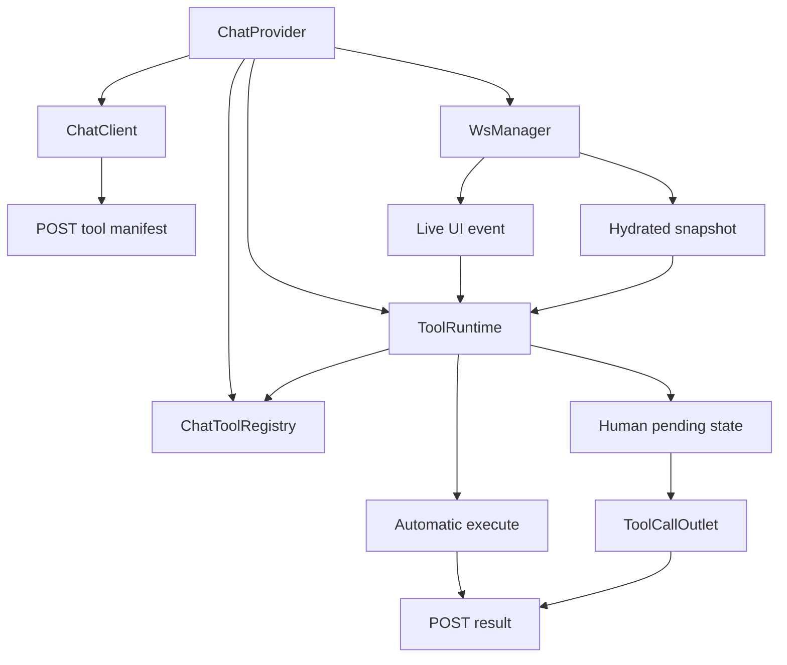
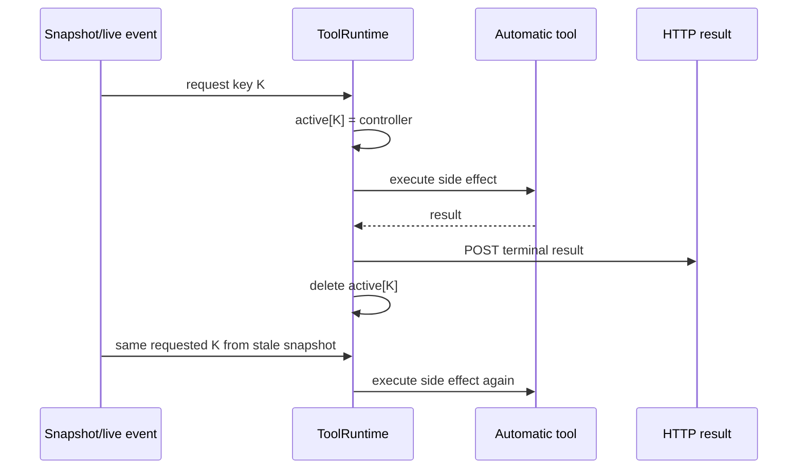
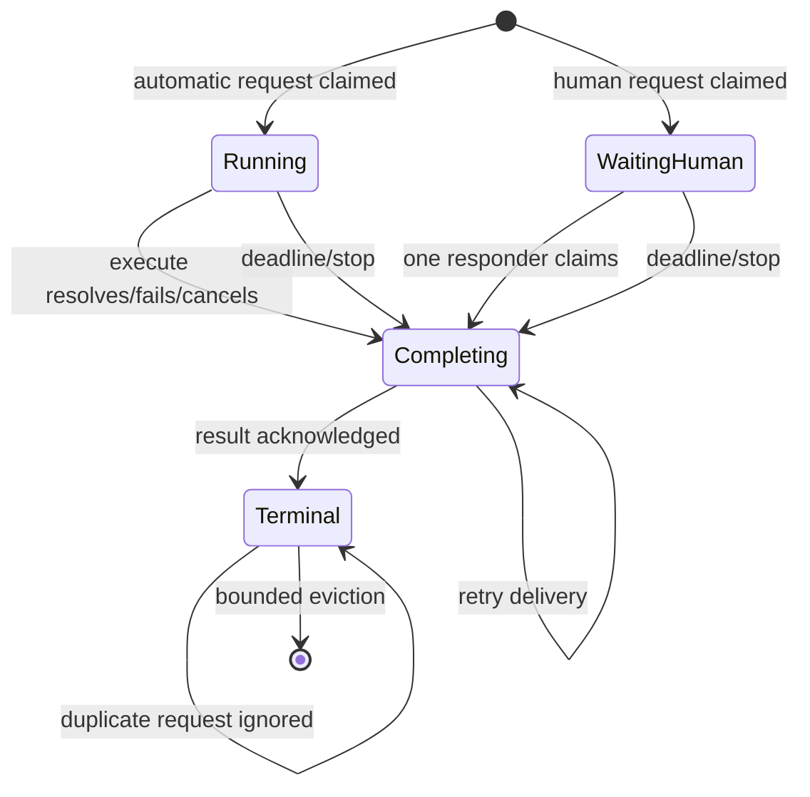

# Chat-provider browser tool runtime hardening: idempotency, executor ownership, manifests, implementation guide

## Executive summary

`@go-go-golems/chat-provider` is the browser half of a frontend-tool bridge. It registers browser capabilities, advertises JSON schemas to a server, receives frontend tool requests over a sessionstream WebSocket, executes automatic tools or renders human tools, POSTs terminal results, and hydrates pending calls after reconnect.

The package currently suppresses duplicate automatic requests only while `activeControllers` contains the call id, and suppresses duplicate human setup only while `pendingHumanTools` contains it. Both structures forget terminal calls. After an automatic call completes and its controller is deleted, reconciliation of the same requested entity executes it again. A direct probe against version 0.5.0 observed two executions and two submitted results for one repeated call id.

Human completion has a parallel defect. `respondToHumanTool` deletes the pending id and submits unconditionally. A second response is also submitted. `ToolCallOutlet` does not acquire a completion claim before invoking the runtime. A rapid double click or two mounted outlets can race.

Multi-tab ownership is also undefined. Every browser subscribed to a session can receive a frontend request. Each has a separate local runtime and therefore passes local deduplication. Both execute local side effects and race result POSTs. Manifests are revisioned only within one registry instance, while server storage is session-wide and arrival-ordered; tabs can overwrite one another's capability set.

The design in this document introduces:

- a full `ToolInvocationKey` instead of bare call id;
- an explicit invocation state machine with bounded terminal retention;
- compare-and-set human completion;
- idempotent result retry without side-effect replay;
- a browser `clientInstanceId` and connection generation;
- an executor lease/assignment check;
- client-scoped, monotonic manifest snapshots;
- per-tool deadlines and cancellation semantics;
- precise debug events and tests for reconnect, replay, remount, and two-tab behavior.

The goal is not “exactly-once network delivery,” which WebSocket/HTTP cannot promise. The goal is **at-most-once browser effect plus idempotent terminal delivery** under duplicate network events, hydration, retry, reload, and multiple subscribers.

## Implementation status (2026-08-24)

The current-protocol phases are implemented:

- **Runtime Phase 0 complete** in `e341aae`: session+call v1 invocation keys, running/waiting/completing/terminal state, bounded replay retention, cached result-delivery retry, human completion compare-and-set, cancellation terminalization, phase subscriptions, and redacted debug events.
- **Manifest Phase 1 complete** in `7aa6b94`: explicit registration ownership/replacement, immutable semantic snapshots, dynamic-availability revisions, and serialized/deduplicated/recoverable HTTP synchronization.
- **Consumer contract correction complete** in `8d555a8`: manifest acknowledgements remain internal until the server protocol supplies a durable acknowledgement contract; public `syncManifest()` remains `Promise<void>`.

Current defaults retain 1,000 terminal invocations for 30 minutes and retry result delivery with exponential delays from 250ms to 5 seconds. Automatic effects are never retried. Built-package validation passed react-chat typecheck, 74 tests, distribution/pack smoke, plus PBUI chat-provider consumer typecheck, 208 tests, and production build.

Protocol-v2 executor assignment, client/generation identity, durable terminal recovery, deadlines, and multi-tab lease behavior remain open. They require coordinated changes under `PINOCCHIO-TOOLCALL-1` and `PBUI-TOOLCALL-1`; no client-only ownership election or hidden dual-protocol adapter was added. Package versions were not bumped or published in these implementation commits.

## 1. Scope and package orientation

### In scope

- `packages/chat-provider/src/tools/toolRuntime.ts`.
- `ToolCallOutlet.tsx` and human tool rendering.
- `toolRegistry.ts` and manifest snapshots.
- `core/createChatClient.ts` manifest/result HTTP behavior.
- `ws/timelineSnapshot.ts`, `timelineEvents.ts`, `wsManager.ts`, and transport identity.
- public types/exports needed by consumers.
- unit, transport, snapshot, and React tests.
- package version/build/publish and PBUI upgrade guidance.

### Out of scope

- server pending-call correctness (Pinocchio ticket `PINOCCHIO-TOOLCALL-1`).
- PBUI approval policy or workbench/sandbox domain semantics.
- session route authentication.
- generic React component styling.
- claiming a local side effect can be rolled back after a lost result.

### Files to read first

1. `src/tools/toolRegistry.ts` — descriptor types, registration, schema conversion, revision.
2. `src/tools/toolRuntime.ts` — request execution and human completion.
3. `src/tools/ToolCallOutlet.tsx` — pending human rendering and response callbacks.
4. `src/core/createChatClient.ts` — HTTP/session/manifest/result order.
5. `src/ws/timelineEvents.ts` — live request delivery.
6. `src/ws/timelineSnapshot.ts` — hydration and reconciliation.
7. `src/ws/wsManager.ts` and `sessionStreamTransport.ts` — subscription lifecycle/reconnect.
8. focused tests beside each file.

## 2. Current architecture

### 2.1 Runtime construction

`ChatProvider` creates one Redux store, tool registry, widget registry, adapter registry, tool runtime, client, and WS manager inside a `useMemo`. Extensions register tools into the registry. The resulting context is exposed to hooks and outlets.



### 2.2 Registry and manifest

`ChatToolRegistry` stores descriptors by name. Registration normalizes missing mode to `frontend`, increments `manifestRevision`, and returns a cleanup function that removes only the exact registered object. `manifest()` evaluates `available`, emits description/mode/input schema, and includes unavailable descriptors with `available:false`.

Strong current behavior:

- provider-safe tool names are validated;
- Zod input schema becomes JSON Schema;
- cleanup does not remove a newer replacement accidentally;
- availability is checked both during manifest generation and before execution;
- result schema is parsed locally before submission.

Weak current behavior:

- duplicate names silently replace by order;
- revision is registry-local, not browser-client/session-global;
- no immutable manifest snapshot object is frozen into a send/run;
- sync request ordering is not serialized or acknowledged in runtime state.

### 2.3 Automatic request path

`handleFrontendToolUIEvent` and `reconcileFrontendToolRequests` both call `executeFrontendTool(payload)` asynchronously.

Execution performs:

1. extract call id and tool name;
2. skip while id is active or human-pending;
3. registry lookup;
4. availability check;
5. input parse;
6. human mode → mark pending and return;
7. backend/non-executable mismatch → fail;
8. create/store `AbortController`;
9. execute tool;
10. parse result;
11. POST success/failure/cancelled;
12. delete active controller.

### 2.4 Human request path

A human request is represented only by membership in `pendingHumanTools`. `ToolCallOutlet` checks registry mode + pending state + absence of result, parses input, renders the tool, and supplies `respond`/`reject` callbacks.

`respondToHumanTool` currently:

```ts
pendingHumanTools.delete(call.toolCallId)
await submitToolResult(call)
```

Deletion is not a claim. It does not test whether the id was present, which tool owns it, or whether another responder already won.

### 2.5 Snapshot reconciliation

`timelineSnapshot.ts` maps durable entities, filters tool calls whose status is `requested`, and calls `reconcileFrontendToolRequests`. This restores human cards and automatic work after reload/reconnect. Hydration is necessary; it is also an at-least-once delivery source.

## 3. Failure model

### 3.1 Completed automatic replay



The runtime cannot distinguish “new call with reused id” from “duplicate delivery of completed call,” because it retains neither full invocation identity nor terminal state.

### 3.2 Lost result versus lost effect

Suppose UI mutation succeeds and result POST fails. Re-executing is unsafe. Merely dropping the request is also insufficient because the server model remains parked. The runtime needs to cache the terminal result separately from the effect and retry only delivery.

```text
side effect outcome = performed once
terminal result delivery = retryable many times, same digest
```

### 3.3 Duplicate human response

Two response paths can race:

- double click before React rerenders;
- duplicate/mirrored outlets;
- proposal menu action plus button;
- repeated callback invocation by custom human tool UI.

Without compare-and-set both POST terminal results.

### 3.4 Multiple browser subscribers

Two tabs share session S:

```text
Tab A runtime ledger: empty
Tab B runtime ledger: empty
Server broadcasts request K
A executes K
B executes K
A and B POST terminal result
```

A local ledger cannot select a global owner. The request needs a server-assigned `executorClientId`, and each client needs stable identity for a connection generation.

### 3.5 Manifest race

Browser A and B both begin revisions at 0. Attach/sync calls can arrive out of order. A server that stores “last arrival for session” can expose a descriptor from the wrong tab or regress a newer manifest.

## 4. Target invariants

1. Every request has a full stable invocation key.
2. One browser client generation is assigned to execute it.
3. A duplicate in `running` or `waiting-human` does nothing.
4. A duplicate in `terminal` never re-executes an effect.
5. A terminal result may be retried with identical content.
6. Human completion is an atomic pending-to-completing transition.
7. Tool name and manifest revision match the selected request.
8. Stop/cancel produces one terminal outcome and blocks later completion.
9. A deadline bounds browser execution/waiting.
10. Terminal storage is bounded and observable.
11. Manifests are immutable snapshots with client/generation/revision identity.
12. Duplicate registration is explicit, not order-dependent surprise.

## 5. Proposed invocation and state types

### 5.1 Invocation identity

```ts
export interface ToolInvocationKey {
  sessionId: string;
  messageId: string;
  runId: string;
  toolCallId: string;
  toolName: string;
  clientInstanceId: string;
  connectionGeneration: number;
  manifestRevision: number;
}

export function invocationKey(value: ToolInvocationKey): string {
  return stableLengthPrefixedEncode(value)
}
```

Do not concatenate with an unescaped colon. Use a stable tuple encoder or canonical JSON digest. The server supplies identity; the browser validates assignment.

### 5.2 State machine

```ts
type InvocationState =
  | { phase: 'running'; request: ToolRequest; controller: AbortController; startedAt: number }
  | { phase: 'waiting-human'; request: ToolRequest; startedAt: number }
  | { phase: 'completing'; request: ToolRequest; completion: ToolCompletion; startedAt: number }
  | { phase: 'terminal'; request: ToolRequest; completion: ToolCompletion; completedAt: number };
```



A map keyed by full invocation identity replaces the active map + human set. Public selectors derive pending status from state.

### 5.3 Completion

```ts
export type ToolCompletion = {
  status: 'success' | 'failed' | 'cancelled' | 'denied' | 'timeout';
  result?: Record<string, unknown>;
  error?: string;
  digest: string;
};
```

The digest covers canonical status/result/error and prevents a retry from changing terminal content.

## 6. Terminal ledger design

### 6.1 Retention

Use a bounded in-memory LRU initially:

```ts
interface ToolRuntimeRetention {
  maxTerminalEntries: number; // e.g. 1,000
  terminalTtlMs: number;      // e.g. 30 minutes
}
```

A reload loses memory, while snapshot may still contain a request. To cover reload, persist compact terminal records per session/client in `sessionStorage` or IndexedDB. Do not persist raw sensitive results by default; persist key + completion digest + server acknowledgement token. The server can request result recovery or expose terminal status in snapshot.

Recommended staged design:

1. in-memory ledger closes same-runtime replay;
2. server timeline marks terminal before acknowledgement, so normal hydrated snapshots omit it;
3. compact session-scoped persistence closes crash/reload race;
4. recovery handshake requests cached completion only when needed.

### 6.2 Claim algorithm

```text
claim(request):
  validate identity and executor assignment
  key = encode(request.key)
  existing = states.get(key)
  if existing running/waiting/completing: duplicate -> ignore
  if existing terminal: duplicate -> maybe retry cached delivery, never execute
  verify tool name/manifest descriptor
  create state before any async operation or render
```

JavaScript's event loop makes synchronous map check+set atomic relative to another callback; do not `await` between them.

### 6.3 Complete algorithm

```text
complete(key, proposedCompletion):
  state = states.get(key)
  require state is running or waiting-human
  synchronously set completing with canonical completion
  await submitWithRetry
  set terminal
```

If submit fails, remain `completing` with effect already final. Retry delivery using the same completion. Never return to `running` or invoke the tool again.

## 7. Human-tool design

### 7.1 Runtime API

Replace permissive response API:

```ts
respondToHumanTool(args): Promise<void>
```

with:

```ts
type HumanCompletionClaim = { key: ToolInvocationKey; claimToken: symbol };

claimHumanCompletion(key: ToolInvocationKey): HumanCompletionClaim | null;
completeHumanTool(claim: HumanCompletionClaim, completion: ToolCompletion): Promise<void>;
```

Or expose one atomic method returning an outcome:

```ts
completeHumanTool(key, value): Promise<'accepted' | 'already-completing' | 'not-pending'>
```

The runtime validates/parses result after claiming. Invalid custom UI output produces one failed completion, not a pending reset that can be abused repeatedly.

### 7.2 Outlet behavior

`ToolCallOutlet` should derive state and pass a single `complete` callback. On first click:

- local card immediately shows `responding`/disables controls;
- runtime claim happens synchronously;
- custom render cannot invoke another completion;
- failure to POST shows retrying, not enabled approval buttons.

React local state is UX only. Runtime compare-and-set is correctness.

### 7.3 Remount

A remount of `waiting-human` should render the same request, not start a second automatic interaction. PBUI's `pbui_accept` uses a component-local `started` ref, which resets on remount; the generic runtime should provide an invocation-scoped human lifecycle or claim token so integrations can distinguish first activation from rehydrated display.

## 8. Browser executor ownership

### 8.1 Client identity

Create a random browser instance id once per tab/session storage:

```ts
clientInstanceId = sessionStorage.getItem(key) ?? crypto.randomUUID()
```

Connection generation increments on a fresh transport subscription. Reconnect within the same logical transport may retain generation if the server lease remains; a replacement connection increments.

### 8.2 Executor assignment

Request identity includes `executorClientId`. Runtime rule:

```ts
if (request.executorClientId !== runtime.clientInstanceId) {
  emitDebug('frontend-tool-not-executor', request.key)
  return
}
```

The server chooses owner based on explicit lease/active-client policy. The browser must not elect by “first event received” because all tabs can race.

### 8.3 Human calls

Human requests may need UI in the active tab. Server lease can move before request, or clients can signal activity and owner. Never let several tabs present actionable cards without one completion owner. Observer tabs may display read-only “waiting in Tab X.”

### 8.4 Possible sessionstream support

The simplest transport keeps broadcast and lets clients filter by assignment. Targeted UI delivery in sessionstream is an optimization/privacy improvement, not required for correctness once assignment fields are authenticated and checked.

## 9. Manifest redesign

### 9.1 Immutable snapshot

```ts
export interface ToolManifestSnapshot {
  clientInstanceId: string;
  connectionGeneration: number;
  revision: number;
  digest: string;
  tools: readonly ToolManifestEntry[];
}
```

`ChatToolRegistry.snapshot()` evaluates availability once, deep-freezes/copies entries, and computes a digest. `createChatClient.send` syncs exactly that snapshot, then uses the acknowledged snapshot identity for the run.

### 9.2 Serialized synchronization

Maintain one manifest sync queue:

```ts
let manifestSync = Promise.resolve<ManifestAck>(initialAck)

function enqueueManifestSync(snapshot): Promise<ManifestAck> {
  manifestSync = manifestSync.then(async current => {
    if (sameDigest(current, snapshot)) return current
    return postManifest(snapshot)
  })
  return manifestSync
}
```

Attach/detach callers should await or observe sync. Do not fire untracked updates. Later revisions cannot be overtaken by earlier ones within one client.

### 9.3 Duplicate registration

Current `register` overwrites by name. Replace with ownership-aware APIs:

```ts
register(tool, { owner }): Unregister
replace(name, { expectedOwner, owner, tool }): Unregister
```

Default duplicate registration throws with old/new owner. Extension installation supplies extension name as owner. Registry diagnostics and Agent Context can display ownership.

### 9.4 Availability reason

Boolean availability is insufficient for model/UI diagnostics. Support:

```ts
availability?: () => { available: boolean; reason?: string }
```

Only `available` reaches providers; reason appears in local debug/context views.

## 10. Timeouts and cancellation

### 10.1 Descriptor timeout

```ts
interface FrontendToolBase {
  timeoutMs?: number;
}
```

Runtime combines server request deadline, descriptor timeout, and global maximum. On expiry:

1. abort controller;
2. atomically complete with `timeout`;
3. submit terminal result once;
4. retain terminal state.

### 10.2 Cooperative limitation

AbortSignal cannot roll back a synchronous/local effect already committed. Tools must check `signal.aborted` before each async side-effect boundary. Documentation should require idempotency keys for external/network writes and revision preconditions for UI writes.

### 10.3 Stop/reset

`cancelActiveFrontendTools` currently clears maps. New behavior transitions every nonterminal invocation to cancelled/completing and submits or records cancellation according to server contract. Reset may discard local UI after terminal persistence/acknowledgement, not silently forget pending human calls.

## 11. Public API changes

Proposed runtime surface:

```ts
export interface ToolRuntime {
  clientIdentity(): BrowserClientIdentity;
  handleFrontendToolUIEvent(frame: CanonicalFrame): void;
  reconcileFrontendToolRequests(requests: FrontendToolRequest[]): void;
  stateOf(key: ToolInvocationKey): InvocationStateView | null;
  isPendingHumanTool(key: ToolInvocationKey): boolean;
  completeHumanTool(key: ToolInvocationKey, value: unknown): Promise<CompletionOutcome>;
  cancel(reason: 'stop' | 'reset' | 'unmount'): Promise<void>;
}
```

Avoid exposing mutable state/maps. Preserve a convenience selector accepting call id only only if the runtime can prove uniqueness within its current session; full-key APIs should be canonical.

`SubmitToolResult` takes full identity/capability and returns server acknowledgement:

```ts
type SubmitToolResult = (result: FrontendToolResult) => Promise<{
  accepted: boolean;
  idempotent: boolean;
  terminalDigest: string;
}>;
```

## 12. Debugging and observability

Emit structured events at each transition:

```text
tool-request-received
tool-request-not-executor
tool-request-duplicate-active
tool-request-duplicate-terminal
tool-execution-started
tool-human-waiting
tool-completion-claimed
tool-result-submit-attempt
tool-result-submit-failed
tool-result-acknowledged
tool-terminal-evicted
manifest-snapshot-created
manifest-sync-acknowledged
manifest-sync-rejected
```

Every event includes redacted identity fields, phase, attempt, timing, and manifest revision. Inputs/results should not be copied into generic debug events by default.

Expose counts/age in devtools:

- running invocations;
- waiting human;
- completing/retrying;
- terminal ledger size;
- executor identity/lease state;
- current and last acknowledged manifest.

## 13. File-level implementation guide

### Phase 0 — In-runtime idempotency and human CAS

**Files:** `toolRuntime.ts`, `toolRuntime.test.ts`, `ToolCallOutlet.tsx` and tests.

1. Introduce internal state union and key helper.
2. For v1 payloads, namespace by current session + call id; accept full v2 key when available.
3. Claim state synchronously before input parse/result failure submission.
4. Keep terminal state after result acknowledgement.
5. If result submit fails, retain `completing` and retry delivery without execute.
6. Make human completion compare-and-set.
7. Update outlet controls for responding/terminal states.
8. Add retention limits and debug events.

### Phase 1 — Manifest snapshots

**Files:** `toolRegistry.ts`, registry tests, `createChatClient.ts`, client tests, extensions.

1. Add owner-aware duplicate rejection.
2. Add immutable snapshot/digest/client identity.
3. Serialize sync and return acknowledgement.
4. Make connect/send await selected manifest ack.
5. surface automatic attach sync failures to observer/debug state.

### Phase 2 — Protocol v2 + executor ownership

**Files:** runtime types, WS protocol mapping, `wsManager`, snapshot/events, client result body.

1. Parse full invocation key and executor id.
2. reject requests assigned to another client.
3. include capability/full key in result.
4. track connection generation.
5. update snapshot adapter tests with v1/v2 migration boundary.
6. coordinate Pinocchio/PBUI releases.

### Phase 3 — Durable recovery/deadlines

1. store compact terminal keys/digests per session.
2. add server recovery acknowledgement behavior.
3. implement deadlines and terminal timeout.
4. define reset/unmount cancellation contract.
5. test crash/reload between effect and result acknowledgement.

### Phase 4 — Multi-tab and operations

1. integrate executor lease endpoint/event.
2. add two-context Playwright suite in a consumer.
3. expose runtime/manifest diagnostics.
4. publish package version and migration notes.

## 14. Test strategy

### 14.1 Runtime unit matrix

| Scenario | Assertion |
|---|---|
| duplicate while automatic running | one execute |
| duplicate after automatic terminal | zero new execute |
| POST fails after effect | retry same result, one execute |
| snapshot + buffered same request | one claim |
| unknown tool | one failed terminal result |
| unavailable tool | one failed terminal result |
| invalid input | one failed terminal result |
| duplicate human response | first accepted, second already-completing/terminal |
| custom human invalid result | one failed terminal |
| stop while running | one cancelled completion |
| late resolve after stop | cannot overwrite cancelled |
| terminal eviction | bounded deterministic behavior |

Use deferred promises/barriers rather than time-based sleeps.

### 14.2 Registry/client tests

- duplicate registration throws and names owner;
- explicit replacement requires expected owner;
- snapshot is immutable;
- revision/digest change exactly when semantic manifest changes;
- unavailable reason is local-only;
- concurrent syncs arrive monotonically;
- identical snapshot does not POST again;
- send uses acknowledged manifest version;
- stale server response is surfaced.

### 14.3 Snapshot/transport tests

- hydrated requested automatic call executes once;
- terminal entity is not reconciled;
- reconnect duplicate event after hydration is ignored;
- request for another executor is observed but not executed;
- connection generation changes on replacement;
- buffer ordering remains correct.

### 14.4 React/human tests

With React Testing Library:

- double click Approve submits once;
- Approve then Reject submits once;
- two outlets for same invocation share runtime claim;
- remount retains waiting/completing state;
- submit failure shows retry state and disabled buttons;
- result schema failure becomes one failed completion.

### 14.5 Commands

From `react-chat`:

```bash
pnpm --filter @go-go-golems/chat-provider typecheck
pnpm --filter @go-go-golems/chat-provider test
pnpm --filter @go-go-golems/chat-provider build:dist
pnpm test
```

Consumer validation in PBUI runs pbui-chat tests/build and executable replay probes against the newly built package.

## 15. Cross-repo rollout

### Step 1: Pinocchio containment

Pinocchio first binds pending calls by session+id+tool and rejects mismatched results. This makes the current client safer without new fields.

### Step 2: react-chat package release

Implement terminal ledger/human CAS/manifest queue behind current protocol where possible. Publish a new `@go-go-golems/chat-provider` version with release notes.

### Step 3: protocol v2 coordination

Pinocchio adds full invocation/executor/manifest fields. react-chat sends/validates them. PBUI updates HTTP request structs and dependencies in one workspace integration branch.

### Step 4: PBUI consumer tests

PBUI verifies:

- one workbench mutation under duplicate event;
- one handoff under reconnect;
- one proposal response under double click;
- two tabs, one executor;
- manifest attachment becomes provider-visible exactly once.

## 16. Risks and alternatives

### Alternative: remember only completed call ids

Better than current code, insufficient. Bare ids can collide across sessions/runs and cannot bind tool/executor/manifest identity.

### Alternative: clear terminal state when result POST succeeds

Rejected. A stale snapshot/event can arrive after POST success. Retain terminal state for a bounded replay window.

### Alternative: let the server's first result win and allow both tabs to execute

Rejected. Server idempotency protects model continuation but not duplicated local UI side effects.

### Alternative: use `localStorage` for one global browser executor

Unsafe/fragile across origins, profiles, crashed tabs, and multiple legitimate sessions. Lease ownership belongs to the server/session protocol; browser storage only supplies client identity.

### Alternative: make all tools retryable

Rejected. Read tools may be safe; UI/external writes need explicit idempotency. Runtime retries delivery, not execution.

### Alternative: hide manifest races by syncing before each send

Current code already syncs before send. Without monotonic client-scoped acknowledgement, that does not prevent out-of-order/multi-tab overwrite.

## 17. Intern checklist

Before requesting review:

- [ ] no async gap exists between duplicate check and state claim;
- [ ] terminal duplicate cannot call `tool.execute`;
- [ ] result POST failure cannot cause effect replay;
- [ ] human completion is compare-and-set;
- [ ] stop/timeout cannot be overwritten by late promise resolution;
- [ ] terminal retention is bounded;
- [ ] manifest sync is serialized and acknowledged;
- [ ] duplicate tool registration is explicit;
- [ ] executor assignment is checked before rendering/executing;
- [ ] debug logs contain identity but not raw sensitive results;
- [ ] focused tests and package dist build pass;
- [ ] public types/docs and migration notes are updated;
- [ ] PBUI upgrades the published dependency and runs consumer tests.

## 18. References

- `packages/chat-provider/src/tools/toolRuntime.ts:1-149` — current active/pending state and response path.
- `packages/chat-provider/src/tools/ToolCallOutlet.tsx` — human render/respond/reject callbacks.
- `packages/chat-provider/src/tools/toolRegistry.ts:1-122` — descriptors, registration, manifest revision/schema.
- `packages/chat-provider/src/core/createChatClient.ts:203-293` — manifest sync, submit result, connect/send ordering.
- `packages/chat-provider/src/react/ChatProvider.tsx` — runtime construction and extension installation.
- `packages/chat-provider/src/ws/timelineSnapshot.ts:70-93` — requested-call reconciliation.
- `packages/chat-provider/src/ws/timelineEvents.ts` — live frontend request delivery.
- `packages/chat-provider/src/ws/wsManager.ts` — transport lifecycle and observer wiring.
- `packages/chat-provider/src/ws/sessionStreamTransport.ts` — hydration/reconnect/generation internals.
- current tests beside those files.
- PBUI `PBUI-AGENT-4` design doc 06 and runtime probes — consumer-level evidence.
- Pinocchio `PINOCCHIO-TOOLCALL-1` — server-side invocation/completion contract.

## Conclusion

chat-provider already owns the right browser abstractions: a typed registry, dynamic availability, input/result validation, a runtime separated from React rendering, and snapshot reconciliation. Hardening should preserve those boundaries.

The key change is to model tool execution as a stateful, identified transaction instead of two transient collections keyed by call id. Claim before executing, retain terminal state, retry result delivery without repeating effects, complete human calls once, and obey an explicit browser executor assignment. Combined with monotonic manifest snapshots, this gives every consumer a predictable browser half for safe agent-driven UI interaction.
